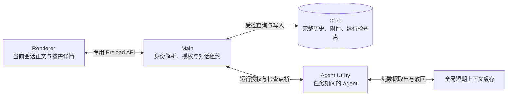

# Agent 对话性能优化方案

> 状态：分阶段实施中。2026-10-02 已开始第一批可独立验证的运行互斥、Renderer 写回安全和列表派生优化，进度见下节；完整运行检查点和 Agent 释放尚未启用。文中的容量是第一版默认值，实施后按真实采样调整；不能把它们解释为应用总内存上限。

## 实施进度（2026-10-02）

第一批落实 A、D、E 的前置工作，不代表这三个阶段已全部完成：

- **运行互斥与真实收尾：**Main 在转发 prompt 前取得按 `sessionId` 串行的所有权，创作域和扩展聊天共用管理守卫；内部 `agent.run_drained` 事件按 Main 生成的唯一请求 ID 释放，Renderer 的终态事件不再代表执行排空。内核等待本轮实际执行 Promise，覆盖正常结束、中止、工具迟到成功或失败；子智能体中止或超时时立即更新显示状态，父运行仍等待子任务实际结束。请求结果未知时保留所有权，Agent Utility 退出时释放。目前采用保守的全局会话 ID，尚未接入权威的 `scopeKey + sessionId` 推导；管理保护覆盖现有删除、清除路径，作用域合并与移除仍待统一接入。也尚未实现排空超时和检查点待处理租约，永不结束的模型或工具仍会阻塞该会话。
- **journal 写回与引用：**本地新建或完整旧格式导入显式注册 baseline；Core 加载的会话显式初始化消息 ID 与顺序，缺失 journal 时拒绝保存。字段缺失不再隐式生成 `remove`，未加载详情内的操作拒绝捕获。已确认后 journal 不持有完整消息 map，仅尚未确认的字段事件持有消息；迟到 ACK 不清除后来发生的修改。100 会话回归验证每轮确认后 journal 的消息强引用、待确认字段和 capture 均归零，重访后仍正确生成增量。
- **Core 消息投影：**优先保留 `id`、`role`、`createdAt`、`runId`、`status`；即使退化到根详情，也保留身份与独立的 `preview`。预览仅供展示，不替代持久化正文。正文和未知字段仍能按引用完整读取。消息分页精确计入页面封装、游标与数组分隔符，剩余预算不足时把消息留给下一页。
- **列表派生与桌面探针：**每行缓存回复正文与审批项，长篇提案按 `runId` 索引并保留未变化行的数组身份；1000 行回归中更新一个运行的提案仅新增一次审批派生。全部正文 DOM 继续保留。修复 Electron 探针的重复 Vue 实例、过期交互夹具和异常退出被当作成功的问题；真实 Electron 的 1000 轮 / 2000 条消息验证选区、滚动、编辑、引用、字号和主题。探针中 `enabled` 比较的是既有 `content-visibility`，两组均包含本次优化，不能作为本次改动的提速百分比。

下一批仍须完成阶段 A 的版本化检查点、Core 耐久暂存与公布、前缀指纹和作用域授权，再进行 B 的影子恢复比较。B 的门槛通过后才可启用 C 的结束释放与纯数据缓存。D 的旧会话释放和详情按需读取仍等待 Main/Core 文本恢复迁移；本批未移除 `storedConversations` 中的完整业务记录。

本批 Renderer 当前实现的[合成采样记录](performance/agent-conversation-2026-10-02.json)保存了 10 / 100 / 1000 轮挂载、输入和流式更新数据，以及真实组件的原生搜索、全选和跨消息选区结果；不包含私有作品正文或真实模型请求，也未采集各进程保留堆。这份记录用于后续同机同数据比较，不是优化前后的对照结论。

本批验证已通过：全量 Vitest 共 759 个文件、4410 项测试，`pnpm typecheck`、`pnpm lint`（含边界与 i18n 检查）、`pnpm build`；完整 Electron 桌面冒烟，以及独立的会话存储迁移、分块读写、崩溃恢复和 receipt 重试冒烟。Renderer 的真实 Electron 探针还验证了 1000 轮会话的原生搜索命中、跨消息选区、编辑与引用、滚动定位，以及窗口宽度、10–24 字号和主题切换。此前设置入口变化导致的过期冒烟选择器已按当前界面修复。

## 结论与约束

采用一套贯穿 Agent Utility、Main、Core 和 Renderer 的方案：**Agent 只在任务运行期间存在；完整的可恢复工作上下文由 Core 保存；已落盘的短期纯上下文受全局预算约束；前端只常驻当前会话需要的数据，过程详情按需读取。**

这套方案同时处理四处内存占用：闲置 Agent、旧会话对象、工具及提案详情、聊天消息组件。任何一处单独限量都不能消除其他三处的长期引用。业务验收要求是连续创作、历史编辑、用户回答、提案审批、撤销、停止、附件、全文搜索、跨消息选中和定位行为保持可用。

现有的上下文压缩设计见 [写作智能体上下文压缩](context-compaction.md)。其中的 `ConversationCheckpoint` 是**压缩摘要检查点**，不是本文要求的**完整运行工作上下文检查点**。实现时应复用压缩结果并扩展持久化能力，不得把二者当成同一个对象。现有文档提及旧附件无法恢复，本文提出的 Core 附件引用是新增目标；旧记录缺失的原始附件无法追溯补回。

内存目标不是让整机 RSS 固定不变。实际占用还包括 Electron/Chromium 基线、正在运行的上下文、当前显示的正文、待保存的数据以及序列化和 IPC 的短暂峰值。本方案重点消除“打开过的会话数、已结束的 Agent 数、已保存的详情数”带来的持续增长。

后文各节都以下列不变量为前提：

1. 检查点是否可用由 Core 按它覆盖的**历史前缀指纹**判定；revision、generation 和删除标记只用于快速拒绝迟到写入，不单独作为有效性依据。
2. 同一对话同一时刻最多一轮处于运行、收尾或待处理状态；检查点以父检查点仍为最新作为公布条件，不允许谱系分叉。
3. 检查点自有存储，不引用会话历史的节点或 `(messageId, path)`；Core 的删除、清除、作用域合并和回收同时处理检查点。
4. 检查点缺失、失效或损坏时，按“最长有效前缀 + 其后可见轮次文本”**显式**降级重建并告知用户；禁止的是静默回退，而不是一切回退。
5. Renderer 不得把来自 Core 的投影当作新数据整条写回，也不得把未加载的字段解释为删除。

## 实施前基线（2026-10-02）

| 层            | 当前实现                                                                                                                                                                                                                          | 结果与设计要求                                                                                                  |
| ------------- | --------------------------------------------------------------------------------------------------------------------------------------------------------------------------------------------------------------------------------- | --------------------------------------------------------------------------------------------------------------- |
| Agent Utility | `packages/pi-runtime-adapter/src/kernel/run-agent.ts` 的 `ConversationAgentCache` 以 100 个为淘汰阈值；超过时尝试移除非流式 Agent，未设置 TTL 或容量预算                                                                          | Agent 的消息、工具闭包、请求和回调可能随对象留存。应以运行作用域代替闲置 Agent 缓存。                           |
| 恢复          | `packages/pi-runtime-adapter/src/kernel/run-model.ts` 的 `restoredConversationMessages` 从用户/助手纯文本重建历史；`packages/contracts/src/session/commands.ts` 的历史消息协议同样只含这两种角色和正文                            | 冷恢复不能等价于仍在内存的 Agent：工具结果、图片和部分运行状态可能丢失。先补齐恢复，再关闭 Agent 缓存。         |
| 内核恢复判定  | `kernel/run-kernel.ts` 以“本轮新建了 Agent”（`createdAgent`）判断冷恢复：新建时调用 `RunContextManager.restore` 把 `policy.checkpoint` 摘要插到消息最前，并让本轮用户消息重新注入完整运行上下文                                   | 每轮新建 Agent 后若不修改，会出现重复摘要，并每轮注入一份完整作品快照。须拆成显式恢复模式。                     |
| 压缩状态      | `kernel/context/state.ts` 以消息对象身份维护 `runStarts`、`runtimeTurns`、`pruned` 等 `WeakMap`/`WeakSet`，另有摘要消息、`compactedAt` 和 `fixedContextStale`；`manager.ts` 的 `beforeRun` 每轮按当前授权重建摘要消息中的恢复内容 | 只序列化 `agent.state.messages` 会漏掉压缩及运行簿记，必须转换为稳定消息 ID，并保存结构化摘要而非重建后的文本。 |
| 并发互斥      | 同一对话不并发运行的唯一保护是缓存 Agent 的 `isStreaming` 检查（`run-agent.ts`、`conversation-agent-rebuild.ts`）；Main 的 `acquireConversationOperation` 只阻止运行中的管理操作，不阻止同会话的并发 prompt                       | 去掉闲置 Agent 后须有显式的对话租约。                                                                           |
| 跨模型转换    | Pi 的 `transformMessages` 在每次请求时跨模型丢弃加密思考、思考转文本、去掉思考签名、规范工具调用 ID、为孤立工具调用补结果、跳过中止或出错的助手消息、为非视觉模型替换图片                                                         | 恢复后的上下文交给同一转换，不另设比活 Agent 更严格的门槛。                                                     |
| Renderer 历史 | `persistence-history.ts` 的 `storedConversations` 累积完整会话；`persistence-journal.ts` 的 `sessions[].messages` 还持有消息引用，确认保存后不清空该图                                                                            | 释放旧会话时必须联动 journal、保存队列和控制器注册表。                                                          |
| Renderer 写回 | `persistence-journal.ts` 的 `capture()` 对 journal 中缺失的会话默认按 baseline 整条 `putMessage`；`persistence-field-changes.ts` 在路径值为 `undefined` 时生成 `remove`                                                           | 释放或按需加载后，缺字段的投影可能整条覆盖或删除 Core 中的详情。                                                |
| 冷恢复组装    | Renderer 的 `agent-conversation/history.ts` 读取全部消息的 `contextCompactions` 定位最新摘要，再取其后全部正文，经 `session.prompt` 最多发送 2000 条、400 万字                                                                    | `contextCompactions` 是 Core 的详情字段；详情按需读取后，现有冷恢复无法在 Renderer 组装。                       |
| Core 读取     | Core 的 `conversation-storage/message-records.ts` 已提供消息投影和详情引用，投影超限时返回空 `value` 加根详情；Renderer 的 `conversationHistoryRecordLoader.ts` 随后又将全部详情物化                                              | 保持 Core 的分页和详情引用，改为按操作读取；投影须常驻身份字段。                                                |
| Core 版本     | `conversation-storage/database.ts` 中 generation 只在实际删除消息、删除或从回收站恢复会话时增加，`scope-merger.ts` 合并作用域时也增加；覆盖已有消息 ID 的 `putMessage` 不增加。`schema.ts` 要求 `schema_version` 恰为 1           | generation 不等于语义分支，不能直接作检查点有效性依据；新增表须兼容旧版本程序。                                 |
| Core 节点     | JSON 节点归单条记录所有，`putMessage` 和 `removeMessages` 递归销毁旧节点；文本 chunk 按哈希共享，经 `node_chunks` 引用计数回收                                                                                                    | 检查点若按节点或消息路径引用历史，历史改写后会悬空。                                                            |
| 作用域键      | 历史作用域键由 Renderer 的会话注册表选择，Main 原样转发 `rendererState.history.*` 命令；Main 没有“运行 → 作用域”的映射                                                                                                            | 检查点写入需要新增 Main 侧的权威推导。                                                                          |
| 前端列表      | `ConversationMessageList.vue` 为各条消息创建组件，以 `content-visibility: auto` 推迟屏幕外绘制                                                                                                                                    | 长对话仍有组件和 DOM 成本；应优先减少重组件与过程详情常驻。                                                     |

这里说的“释放”指解除所有可达引用、让 GC 有机会回收，不承诺进程 RSS 随后立即下降。先用保留堆快照定位引用链，再用真实 Electron 工作负载测量效果。

已有基础应继续利用：Core 有分页、详情读取、分块暂存（stage）和按哈希共享的 chunk；只读历史读取器已有默认 16 MiB / 2000 项缓存；关闭的 `ConversationDetails` 会卸载内部详情；差异预览已有渲染限制；Core 的 SQLite 提交已有 revision、generation 和幂等 receipt。新实现应接入这些机制，避免建立第二套历史库、第二套授权路径或重复的数据模型。

## 目标架构与数据归属

职责边界如下：

- 共享运行内核 `packages/pi-runtime-adapter/src/kernel/` 负责 Agent 创建、显式恢复模式、任务收尾、上下文序列化与恢复。创作域仍走 `session.prompt`，扩展域仍走 `extrasAgent.run`。只有可续聊会话需要运行检查点；一次性分析沿用现有结果保存，普通子智能体把必要结果交给父任务，两者均不进入闲置上下文缓存。
- Main 解析会话、智能体身份及当前授权，并持有对话租约；Agent 只能通过受限的 Main → Core 桥写入自身的检查点。历史作用域键改由 contracts 中的共用推导函数，从 `session.prompt` 的工作区上下文或扩展任务计算，Main 在接受运行时登记，Core 再核对该会话确属此作用域；不采信 Renderer 或 Agent 申报的键，无法推导的会话不启用运行检查点。Renderer 不获得任意文件路径或 Agent 内部对象。
- Core 是完整聊天历史、可恢复检查点、附件与提案数据的持久化权威。它用现有会话存储演进，检查点保存和读取受 schema、版本及身份校验，有效性按历史前缀指纹判定；作品的实际修改继续走提案审批和版本冲突检查。
- Renderer 维护交互状态、当前会话的正文投影与必要的临时数据；历史列表只保留索引和摘要。只读展示投影不能直接送进可写 journal。Renderer 不再为冷恢复组装文本历史。

## 生命周期与默认内存预算

| 状态或数据 | 保留内容                                          | 释放或失效条件                                                                                                      |
| ---------- | ------------------------------------------------- | ------------------------------------------------------------------------------------------------------------------- |
| 运行中     | Agent、工具、请求、当前上下文及实际执行中的子任务 | 模型请求、工具、子任务和监听回调确实结束后进入收尾；等待用户回答或授权仍是运行中。                                  |
| 收尾中     | 仍可读取的 Agent 状态及正在构建的纯数据检查点     | Core 确认检查点持久化后放弃 Agent 引用；排空等待有上限，超时按“运行收尾”第 2 步处理；收尾期间不启动同会话的新一轮。 |
| 最近使用   | 无 Agent、无工具函数的纯可恢复上下文              | 全局最多 **2 份**、合计驻留预算 **64 MiB**、单份最多 **32 MiB**、最后一次有效使用后 **5 分钟**过期。                |
| 长期历史   | Core 内完整会话、附件、提案和工作上下文检查点     | 沿用现有删除与版本规则；LRU 淘汰不删除磁盘历史。                                                                    |
| 保存失败   | 一份待保存的纯数据及重试状态                      | 保存成功后转入最近使用或释放；该会话暂缓下一轮，不能丢弃这份数据。                                                  |

同一对话（`scopeKey + sessionId`）由 Main 持有租约，覆盖运行中、收尾中、`save-pending`、`history-pending` 等全部状态。租约存续期间，Main 拒绝同会话的新 prompt 并返回可识别的错误码，同时阻止删除、清除和作用域合并等管理操作；现有 `acquireConversationOperation` 只看活动运行，须并入同一租约。租约以对话而不是智能体键为单位，因为同一会话的可见历史只有一份。

缓存由共享运行服务统一管理，覆盖创作域和扩展域，不能为每个页面、作品、智能体或窗口重复分配 64 MiB。计量值包含保留的序列化数据、必要索引和其他驻留开销；不得只用 JSON 文件字节数声称堆内存已受控。缓存命中时先从闲置集合取出，再解码为本轮活动上下文，避免缓存对象与活动对象同时长期持有同一份数据。一次性任务和普通子智能体结束后直接释放。长篇多阶段并行或团队模式下多个会话交替时，2 份可能频繁冷读；冷读走 Core 的分块流式读取，不在 Core、Main、Agent 三处各物化一份完整对象，容量按采样调整。

超过预算时淘汰最久未使用的**已落盘**条目。单份超过 32 MiB 的工作上下文仍须完整落盘，但不进入闲置缓存。读取时检查过期；最近的到期时间触发精确清理，30 秒周期检查作为兜底，应用从休眠恢复时再次检查。应用空闲超过 5 分钟后，闲置上下文缓存应为零。计时器不能捕获 Agent 或大上下文对象。

预算只约束**闲置缓存**。正在执行的任务、当前展示内容、真实未落盘数据和短暂传输开销不受 64 MiB 硬截断；不能为了满足数字而中止运行、删除历史、丢掉审批材料或撤销快照。异常情况下可能同时存在若干会话的待保存数据，不能承诺全局硬上限；存储持续故障应进入可见的保存故障状态，并阻止这些会话继续积累新轮次。

## 运行工作上下文检查点

### 内容和版本

新增一个版本化、可校验的运行检查点协议，与现有 `ConversationCheckpoint` 压缩摘要类型明确区分。它保存的是本轮结束时**实际可继续用于模型请求的工作上下文**，而不是完整的聊天展示历史。建议包含：

1. 范围：`scopeKey`、`sessionId`、对话智能体键（含档案，与现有 `conversationAgentKey` 一致）、创作/扩展域、资源身份、`runId`、父检查点 ID，以及覆盖到的历史位置和**前缀指纹**（见“有效性判定”）。Core generation 不写入有效性条件。
2. 版本：检查点格式、运行时消息编码版本、压缩状态版本、附件引用版本、校验摘要；恢复时先判定兼容性。
3. 有序消息：系统实际保留的用户、助手和工具消息/结果，消息稳定 ID、角色、内容块、模型来源，以及工具调用 ID 与结果的成对关系。保留必要的多模态块和供应商专用字段；严禁把历史助手消息统一改写成当前模型元数据。稳定 ID 在消息进入工作上下文时分配，剪枝改写时随 `transfer` 转移到新对象；内容是否变化以内容哈希识别，增量写入和去重按哈希而不是 ID。
4. 压缩状态，逐项保存，缺任何一项都会让恢复后的下一轮与活 Agent 不同：
   - 结构化的 `ConversationCheckpoint`（摘要、`firstKeptRunId`、refs）及摘要消息位置，而不是 `beforeRun` 按当前授权重建后的摘要文本；恢复后照常按当前授权重建恢复内容，避免冻结旧技能正文或旧章节结尾。
   - `runStarts`（发起运行的消息与 runId）和 `pruned`。
   - `runtimeTurns` 的用户原话与“带作品快照”标记；剪枝靠它把旧快照换回原话，缺失后旧快照永远不可剪。
   - `fixedContextStale`。
   - 用量失效边界。现有 `compactedAt` 是挂钟时间，用于排除压缩前的供应商用量；保存为“此消息 ID 及之前的用量不再代表当前上下文”，否则恢复后会以压缩前的大用量估算并误触发压缩。
5. 本轮已消费的用户输入边界。父会话目前不使用 Pi 的 steer/followUp 队列（仅抽卡评估子任务使用 followUp）；仍有等待回答或待执行工具时不声明任务完成。若以后为父会话引入排队输入，须由会话编排持久化并确认接管。
6. 继续所需的附件引用：由 Core 管理原始内容，记录内容标识、版本、大小与权限范围；单独保存文件名不足以恢复图片或文本附件。工作消息和 `runtimeTurns` 原话中的内联图片块编码为附件引用，解码时按引用取回；已并入用户消息正文的文本附件随正文保存。
7. 工具完成状态：区分已完成、失败、中止、结果不明，保留已经产生的结果供模型阅读。工具函数、请求对象、密钥、计时器、回调和写入授权不在检查点内。

带快照的用户消息和读取类工具结果含有作品正文、设定、技能和素材的副本。为与活 Agent 等价，这些内容随检查点保存，但只是历史上下文，不构成授权：新的读取、摘要中的恢复内容和写入均按当前授权重新获取。作品、资料库或作用域删除时，Core 连同检查点一并清除。

检查点自有存储：以消息为单位写入 Core 现有的 JSON 节点，相邻检查点中未变化的消息在 chunk 层按哈希共享。因此不需要也不允许引用会话历史的节点或 `(messageId, path)`——历史改写会递归销毁这些节点，提案状态补丁也会改变其内容。提案、撤销快照等功能数据仍以会话历史为权威；检查点只保存模型实际看到的内容。写入复用现有分块暂存，读取同样分块流式进行，避免为保存或恢复一次性生成多份完整 JSON 字符串、对象树和 IPC 载荷。新增的检查点表须接入清除（`purge.ts`）、作用域移除、作用域合并（`scope-merger.ts`）和 chunk 回收。

保留策略：可见历史中每个已完成运行保留其已公布检查点，以支持从任意轮次重发；相邻检查点共享 chunk，增量近似为该轮新增内容。随历史删除的运行，其检查点一并回收。若采样显示占用过高，可退化为只保留压缩边界和最新检查点，其余位置的重发走降级重建。

数据库当前要求 `schema_version` 恰为 1，提升版本会让旧安装包无法打开全部历史。新增表采用不改变版本号的增量建表；旧版本程序不会维护检查点，但有效性按前缀指纹判定，降级运行期间的任何历史改写都会让相关检查点自然失效。新版本启动时清理会话已清除或作用域已移除的孤立检查点。

现有压缩阈值、摘要模型、重试与超时继续生效。`afterRun` 的空闲压缩仍在完成事件之前执行；检查点在它结束后生成，它失败时照常以当前上下文生成。收尾本身不再额外调用模型生成摘要；若上下文已大于 32 MiB，只影响短期缓存准入，不影响保存与继续创作。

### 有效性判定

Core 在保存每条消息时计算语义哈希，覆盖角色、正文、附件引用、`runId` 和终态；提案状态、阅读状态、用量等非语义字段不参与。前缀指纹是按位置串联的 `(messageId, 语义哈希)` 链。检查点公布时记录它覆盖到的位置与指纹；恢复时 Core 用当前历史重算比对，一致才可用。

这样判定有三个结果：从回收站恢复、作用域合并等不改变内容的操作不会误伤检查点；编辑、重发、删除中间消息会让修改点之后的指纹不再匹配，修改点以前公布的检查点仍然可用；旧版本程序或缺陷写入的改动同样能被识别，不会让过期检查点复活。revision、generation 和删除标记继续用于快速拒绝迟到写入。

### 恢复语义

1. Main 接受 prompt 时取得对话租约，并向 Core 查询该智能体键当前的最新已公布检查点及其有效性（head）。Agent 先查短期缓存，命中项的检查点 ID 须与 head 一致才能使用；不一致或未命中时向 Core 分块读取。缓存数据与 Core 数据经过同一套解码、版本和关联校验。缓存条目在 Agent Utility 中驻留时看不到 Renderer 对历史的改写，因此命中也必须比对 head。
2. 内核按显式模式建立 Agent，替代现有以 `createdAgent` 判断冷恢复的逻辑：
   - **新会话**：没有历史，首轮注入完整运行上下文。
   - **检查点恢复**：安装工作消息与压缩簿记；不再调用以 `policy.checkpoint` 前插摘要的 `restore`。是否重新注入完整运行上下文由恢复的 `fixedContextStale` 决定，与活 Agent 一致。
   - **文本恢复**：旧格式会话或降级重建，沿用现有 `restoredConversationMessages` 与摘要检查点路径。

   三种模式都使用当前 Main 解析的模型、档案提示词、工具定义、用量与授权创建 Agent。作品、素材和技能等实时来源按现有授权重新读取，不能沿用检查点中的旧授权。

3. 模型或供应商切换时，工作消息保留原始内容块及各自的 provider/api/model，请求时交给与活 Agent 相同的 Pi `transformMessages`。恢复路径不设比活 Agent 更严格的拦截，否则影子比较无法一致，现在可用的中途换模型也会被禁止。只有现有路径同样拒绝的情况（如本轮新附件不被模型支持）才报错。
4. 工具结果作为上下文恢复，已经完成的工具操作不得重放。状态不明的修改需检查 Core 中实际作品版本及提案状态；仅凭检查点不能推断外部副作用未发生。
5. head 缺失、失效、损坏或解码不兼容时，取该智能体键下前缀仍匹配的最近检查点，加上其后可见轮次的文本重建；没有可用检查点时等同现有文本恢复。会话中显示可见提示，说明哪些轮次只以文本恢复、工具结果和附件未恢复。降级同样受现有传输上限约束，超限时停止并报错。降级后的这一轮结束即生成新检查点，此后恢复重新等价。

既有冷历史不一定含有完整的原始工具结果或附件。迁移时应先把仍存活的 Agent 导出为完整检查点，再启用结束释放；其他旧历史走文本恢复，按旧格式明确标记和处理，不能宣称过去缺失的数据已补全。文本恢复的组装（定位最新摘要检查点、取其后正文）须在阶段 D 之前移到 Main 经 Core 读取，因为它依赖 `contextCompactions` 详情和全部正文，Renderer 按需加载后不再持有这些数据。**完整等价恢复的承诺从成功生成新版检查点开始。**

启用运行检查点的会话，Renderer 不再在 `session.prompt` 和 `extrasAgent.run` 中携带完整文本历史与 `replace` 标记；分支判定由 Core 的前缀指纹负责。过渡期两者同时存在时以 Core 为准，Renderer 字段只服务文本恢复路径，相应的 contracts 字段在迁移完成后收窄。

## 运行收尾与持久化协议

收尾必须覆盖正常完成、用户停止、请求失败、上下文压缩失败、页面离开、Agent Utility 关闭等出口，且对同一 `runId` 只执行一次。建议将运行状态明确为 `active → draining → checkpointing → persisted → released`；这里的 `persisted` 是检查点**暂存数据已落盘**，`released` 是 **Agent 已释放**，还需等待历史对齐后检查点才能 `published`、会话才能进入 `ready`。暂存失败进入 `save-pending`；界面历史未确认进入 `history-pending`；旧分支失效进入 `invalidated`。上述状态都由 Main 的对话租约覆盖，阻止同一会话启动下一轮和管理操作。

1. 停止接收本轮新工作；保留现有停止、中止、重试、队列及用户回答语义。用户输入请求仍未得到答案、工具仍在执行、普通子任务仍持有可执行工作时，不进入闲置状态。
2. 等待模型传输、实际工具 Promise、子任务、SDK 运行 Promise 和必要的事件回调结束。不能仅凭 UI 的终止事件或 `agent.state.isStreaming === false` 判断静止。Pi Agent 当前提供 `waitForIdle()`，但子任务注册表仍需覆盖工具以外的工作。等待设有上限：超时后保留该工具调用并把结果记为“结果不明”，以此生成检查点；同时由 Main 撤销该 run 的全部 Agent → Core 授权，使迟到的工具无法再写入。界面在排空或超时前显示“停止中”。
3. 在事件监听器外部执行等待，避免从被等待的 `agent_end` 回调内部调用 `waitForIdle()` 而死锁。一个带 `finally` 的、可重复调用的最终化函数统一覆盖 `run-kernel.ts` 中启动 Promise 的 `.finally()`、外层异步生成器的 `finally` 和停止路径。
4. 在 `afterRun` 空闲压缩结束后，把有效工作消息、压缩簿记和依赖引用转换成无 Agent 引用的纯数据。检查未完成的工具调用；已完成结果保留为上下文，状态不明的写操作不推断为“未执行”。
5. 通过 Main 的受限收尾授权将纯数据交给 Core。Core 先校验身份、作用域、父检查点和会话状态，以稳定提交键耐久暂存检查点数据；暂存确认不等于已公布为最新可恢复版本。
6. Core 确认检查点数据已落盘后，即可释放 Agent 缓存/注册表引用、SDK 订阅、工具钩子、`prepareNextTurnWithContext`、定时器、请求与闭包引用；即使界面历史写入仍在重试，也不继续持有 Agent。暂存本身失败则仅保留纯数据重试。SDK 没有可假设的 `dispose()` API；只在确认静止后调用其实际支持的清理能力，并解除应用持有的引用。
7. 公布由 Core 在事务内完成，两种到达顺序都要覆盖：检查点先暂存时，在之后某次历史提交的同一事务内检查条件；历史先落盘时，在暂存检查点的事务内直接检查。条件为：历史中存在 `runId` 等于该运行、处于终态（完成、停止或错误）的助手消息；检查点记录的前缀指纹与当前历史一致；父检查点仍是该智能体键的最新已公布检查点。满足即原子公布，并把合格的纯数据放入短期缓存；不合格的直接释放，下一轮从 Core 恢复。Agent 侧的助手消息 ID（`${runId}_assistant`）与 Renderer 生成的 ID 不同，二者只以 `runId` 关联。

Renderer 收到终态事件后，对该会话执行一次不允许延后的保存，不依赖带 `allowDeferred` 的批量 flush；否则 Core 等待历史、Renderer 延后写入，会话会长期停在 `history-pending`。“可接受下一轮”以新增的会话就绪事件为准，不再以 `agent.completed` 为准；Main 在租约未释放时拒绝同会话 prompt 并返回专用错误码，界面据此显示“保存中”。

跨重启对账：应用或 Agent Utility 重启后，Core 在下一次读取该会话 head 时处理残留的暂存检查点。条件已满足则公布；历史中没有对应的终态助手消息、也没有运行占用租约，则废弃该暂存（这一轮在界面上同样不存在），恢复走上一份已公布检查点加文本尾部。

Main 目前主要按活动 `runId` 授权 Agent → Core 命令。收尾阶段需要一个范围更小、可超时清理的 `finalizing` 授权，只允许提交或读取该运行的检查点，不开放作品写入，也不接受来自 Renderer 的任意目标路径。Main 用前述共用推导函数填入作用域，并按现有身份映射填入资源和档案；Core 再校验一次。收尾授权、对话租约和管理守卫须统一，收尾期间的删除、清除和作用域合并同样被阻止。检查点协议与 IPC 改动先落在 `packages/contracts`，再接 Main、Agent Utility、Core 和必要的 Preload；Renderer 仍只引入 `@deepwrite/contracts/renderer` 的运行时契约值。

Core 使用现有会话存储的原子提交与幂等 receipt。检查点提交键为 `scopeKey + sessionId + agentKey + runId`，内容含父检查点 ID 与前缀指纹；同一键重复提交相同内容返回相同确认，内容不同则拒绝。会话已删除、已清除或作用域已移除时，Core 拒绝暂存与公布。完整历史仍沿用现有增量写入。**Agent 可在检查点数据暂存确认后释放，但同会话不能在公布前续跑**。不能仅因 Renderer 已排队保存就允许下一轮。

历史版本区分 Core 存储 revision 与语义分支；语义分支不另设计数器，由前缀指纹表达。纯元数据、阅读状态和提案状态变化不改变指纹；编辑或重发历史、删去消息会改变修改点之后的指纹。改变会话归属（作用域合并）和从回收站恢复不改变指纹，检查点在同一事务中随会话迁移，而不是失效。切换智能体身份不影响其他身份的检查点，新身份使用自己的检查点或降级重建。加载或保存时以 Core 权威版本为准，避免延迟响应覆盖新历史。

任务很长时，可以在完整工具调用与结果、压缩完成等安全边界分段保存；最终检查点仍须在任务真正结束后完成。分段写入不能把半条工具结果、半张附件或不完整的摘要发布为可恢复状态。第一版先保证结束时的耐久交接；运行中意外进程退出的恢复深度以实际已保存的安全边界为准，不声称能恢复从未落盘的模型输出。

## 保存失败、中止和恢复失败

| 情况                       | 必须执行的处理                                                                                                                                                                                                                        |
| -------------------------- | ------------------------------------------------------------------------------------------------------------------------------------------------------------------------------------------------------------------------------------- |
| Core 写入失败或确认超时    | 销毁已静止的 Agent；保留待保存的纯数据与稳定幂等提交键，后台有限重试并在界面显示保存失败。该会话暂缓下一轮，防止上下文继续增长。不能将这份数据纳入可淘汰的 64 MiB LRU。用户可显式放弃这份检查点以解除阻塞，此后该会话按降级重建继续。 |
| 结果未知，例如 ACK 丢失    | 用相同提交键查询 receipt 或幂等重试；绝不能换一个键盲目重做已完成的写操作。                                                                                                                                                           |
| 用户中止                   | 终止模型和工具，等待真实收尾；持久化最终化使用与用户中止信号分离的控制。记录明确完成的结果及未确认状态。排空超过上限时按“运行收尾”第 2 步处理，不无限等待。                                                                           |
| 同会话重复发送             | Main 的对话租约拒绝第二个 prompt；即使租约因故失效，Core 公布时校验父检查点，也不会产生分叉谱系。                                                                                                                                     |
| 收尾或待处理期间的管理操作 | 删除、清除、作用域合并等待租约释放；清除时 Core 一并删除仍在暂存中的检查点。                                                                                                                                                          |
| 恢复失败                   | 按“恢复语义”第 5 步显式降级重建并提示；不使用静默回退。降级后仍超出传输上限时停止这一轮并报错，保留历史。冷缓存项损坏时先从 Core 重读并校验。                                                                                         |
| 历史编辑、删除、换智能体   | 修改点之后的前缀指纹不再匹配，旧缓存不再命中；仍可使用修改点以前公布的检查点。删除会话、清除和作用域移除由 Core 拒绝迟到写入并清理检查点；从回收站恢复和作用域合并不使检查点失效。                                                    |
| 模型或档案配置变更         | 每轮重新解析当前配置。旧工作消息保留其来源，交给与活 Agent 相同的转换；工具和授权重新生成。                                                                                                                                           |
| 应用关闭且仍有待保存数据   | 依照现有关闭前 flush 机制尽力完成；若存储持续不可写，明确提示保存故障。未曾成功写入磁盘的纯内存数据无法对进程崩溃提供耐久保证；已暂存未公布的检查点按跨重启对账处理。                                                                 |

待保存数据的重试状态与普通闲置缓存分开管理。Core 长期不可写时，多个会话的待保存数据可能占用超过缓存预算；此时应阻止这些会话新增运行、保持只读查看和停止能力，并提供可见的错误，而不是为了数字删除未保存上下文。已经有 Core 暂存 receipt 的数据可以以 receipt 为恢复依据，避免长期再持有第二份完整内存副本。

## Renderer：历史、journal 与详情释放

### 会话控制器与写入状态

切换或新建会话时，不再把完整旧会话留在 `storedConversations`。历史索引保留 `sessionId`、标题、更新时间、消息计数、待审提案数和保存进度等轻量字段；再次打开时从 Core 分页加载。当前会话的可编辑业务状态仍由控制器维护。切换中发生的加载失败应保持原会话可用，不用空投影替换完整数据。

旧会话释放前需要一个覆盖所有持有者的 `canEvict(sessionId, revision)` 判断：

- 对应 revision 的增量历史及相关附件、提案已获得 Core 确认，没有比确认值更晚的修改。
- journal 无尚未确认的 baseline、字段修改、结构变化、消息替换或 in-flight capture；保存队列无 pending、retry、in-flight、deferred error 或未知结果。`allowDeferred` 的 flush 返回不能单独作为可释放证明。
- 没有运行中任务、等待回答、正在审阅或撤销、编辑、导出、异步加载、历史重写、删除等依赖完整对象的操作。
- Core 会话 generation 与当前控制器一致；引用失效后，迟到结果不能重新注册旧控制器。

满足条件时，应一起释放 `storedConversations` 中的完整消息、journal 的 `SessionChanges.messages` 引用、保存捕获对象、Controller 注册表项和相关监听器。journal 可以留下已确认的消息 ID、顺序、revision 与小型字段索引，但不能继续引用完整 `ChatMessage`。失败写入只保留必要的增量操作与待保存负载；确认旧 revision 时不能误删随后产生的新修改。多窗口或多个控制器不能各持有一份无限增长的历史缓存。

释放和按需加载之前，先修改现有写回路径中两个与此冲突的默认行为：

- `persistence-journal.ts` 的 `capture()` 会为出现在 `storedConversations`、但 journal 中没有记录的会话建立 `baseline: true`，下一次保存对其每条消息 `putMessage`，而 Core 的 `putMessage` 会先销毁旧节点树。只要一个缺详情的投影在释放后重新进入 `storedConversations`，详情就会被整体抹掉。改为：只有本地新建、尚未写入 Core 的会话可以 baseline；来自 Core 的会话必须经 `initializeSessionBaseline` 建立记录，缺失记录时拒绝保存并报错，而不是整条重写。
- `persistence-field-changes.ts` 在路径值为 `undefined` 时生成 `remove`。改为：只有业务操作明确删除时才生成 `remove`；路径位于未加载的详情内时拒绝捕获，先按引用读取再修改。

### 只读投影、详情和提案

Core 的消息页已带 `details` 引用。Renderer 打开会话时加载消息正文、状态、顺序、预览及详情引用；默认不循环读取所有 `thinking`、`toolCalls`、`processingSteps`、`subagentRuns`、`editProposals`、`contextCompactions` 和 `evaluationSnapshot`。详情展开、提案审阅、撤销和导出时再按 revision 读取，读到版本变化就取消旧结果并重查。Core 投影须常驻身份字段（`id`、`role`、`createdAt`、`runId`、`status`）与正文预览，正文过大时作为详情读取；不得再出现整条 `value` 为空、只剩根详情的投影，否则列表、搜索和定位都无法工作。冷恢复所需的最新摘要位置由 Main 经 Core 获取，Renderer 不为组装恢复历史而物化 `contextCompactions`。

历史读取器已有 16 MiB 默认容量；将它作为共享的只读详情预算，而不是每创建一个页面或控制器就再分配一份独立大缓存。读取中的巨大详情可以作为一次操作的活动数据，退出操作后释放；超过预算的条目不进入闲置缓存。被当前选区、键盘焦点、编辑、提案审阅或正在运行的工具操作使用的内容在操作期间受保护。

定义不同的展示投影与写入操作类型。投影中缺少尚未加载的字段，不能被 `cloneMessageForPersistence`、journal baseline 或“完整替换消息”路径解释成字段删除。只允许业务操作提交明确的字段修改、状态变更或完整且经过校验的消息；Core 负责合并和版本冲突检查。

待审提案的 `proposedText`、差异数据及已接受提案的 `discardSnapshot.beforeText` 属于功能数据。后者是现有撤销实现的必要输入，不能直接清除。完整数据留在 Core，需要操作时按提案 ID、版本和内容引用取回；列表及聊天卡片平时只保留状态、标题、预览和内容引用。原始工具参数文本与解析后的参数在实时显示后可退出闲置内存，但完整原始记录仍在 Core 以支持查看和诊断。共享不可变详情要限制可写别名，状态改变通过小型补丁进行，不能让两个消息对象共享会被原地修改的提案负载。

### 消息组件和 DOM

第一版保留当前会话用于原生复制、跨消息选择、全文查找与定位的正文节点，减少屏幕外复杂消息组件、事件监听和过程详情的长期挂载。正文呈现应复用按消息 ID 与内容版本缓存的结果；正在流式输出的消息继续按现有节奏更新，避免全列表反复计算。代码的可搜索文本随正文保留；复制按钮、语法高亮、工具卡片、提案差异、运行轨迹等复杂交互在展开或进入视口后挂载，离开且无焦点、选区、编辑或审阅时卸载。

不将整行虚拟化作为第一版默认方案。现有 `conversation-view-probe.mjs` 覆盖 `selectAll`、跨历史范围选择和 Electron `findInPage`；卸载屏幕外正文可能改变这些原生行为。`useConversationWindowPins.ts` 只保护已经挂载的选区节点，不能让未挂载文字成为浏览器原生选区的一部分。若后续确需正文 DOM 恒定规模，必须另行证明全文查找、跨未挂载范围拖选、复制、键盘导航、可访问性、动态高度和滚动锚点都与现状等价，才启用完整虚拟列表。第一版仍允许当前会话正文 DOM 随正文规模增长，这一剩余成本要在性能报告中单独列出。

## 功能边界与失效规则

| 操作                     | Agent / 检查点                                                                                                                                      | 前端历史与详情                                                       |
| ------------------------ | --------------------------------------------------------------------------------------------------------------------------------------------------- | -------------------------------------------------------------------- |
| 新建或切换会话           | 旧运行若仍在等待输入或工具则继续运行；已结束 Agent 释放，短期上下文按预算保留                                                                       | 旧会话等待准确的保存确认后卸载完整控制器，留索引；新会话按需读取。   |
| 历史编辑、重发、删除消息 | 修改点之后的前缀指纹不再匹配，旧缓存无效；使用修改点以前公布的检查点，其后仍可见的轮次按降级重建，新的写入不覆盖旧分支                              | journal 保存明确的删除/替换操作，Core 拒绝旧 revision 的迟到保存。   |
| 删除会话或作品范围       | 删除标记和身份校验拒绝旧保存和旧缓存；清除时一并删除检查点                                                                                          | 等待或取消相关读写，清除控制器、选区和详情缓存；不复活已删除记录。   |
| 从回收站恢复、作用域合并 | 检查点随会话在同一事务中迁移，前缀指纹不变则继续有效                                                                                                | 等待租约释放后执行；控制器按新作用域重新加载。                       |
| 切换智能体档案或模型     | 按当前 Main 配置重建；检查点按智能体键分开，不同身份不共享闲置缓存；切回原身份时使用其检查点加中间轮次文本并提示；模型变化交给与活 Agent 相同的转换 | 已保存的可见历史、提案和用量归属保持自身版本。                       |
| 提案审批、撤销           | 只引用已保存提案，不靠 Agent 对象保持审批能力；工具仍走当前授权与作品版本校验                                                                       | 审阅时加载完整差异和快照，操作结束退回引用；冲突报错与当前行为一致。 |
| 附件重用                 | 根据 Core 的不可变内容引用、版本和授权重新读取                                                                                                      | UI 可显示元数据，打开或重新使用时验证原始文件仍可读。                |
| 一次性分析或普通子智能体 | 完成后不进入闲置缓存；需持续的父任务等待真实子任务结果                                                                                              | 分析结果仍按现有扩展域事件保存和展示。                               |

本方案覆盖创作空间、素材库、技能库、设置中的智能体配置，以及“更多功能”中复用共享内核的聊天与分析。扩展能力不得把任务字段塞进创作域的 `session.prompt` 或 `WorkspaceRuntimeContext`；作品读写保持 Main 授权与 Core 唯一写入边界。

## 落地顺序与改动范围

| 阶段                 | 主要改动                                                                                                                                                                                                                                                                                                          | 完成门槛                                                                                                           |
| -------------------- | ----------------------------------------------------------------------------------------------------------------------------------------------------------------------------------------------------------------------------------------------------------------------------------------------------------------- | ------------------------------------------------------------------------------------------------------------------ |
| A. 采样与协议        | 固定现有功能基线；在 `packages/contracts/src/session/` 和共享协议中定义版本化运行检查点、附件引用、读写命令、会话就绪事件和错误；Core 增加原子暂存、公布、查询、校验和幂等 receipt，每条消息的语义哈希与前缀指纹，检查点表接入清除、合并和 chunk 回收；Main 增加作用域推导与对话租约                              | 旧历史可照常打开，新检查点能独立保存与读取；保存失败不写出半成品；同会话重复发送被拒绝。                           |
| B. 影子恢复          | `packages/pi-runtime-adapter/src/kernel/context/` 和 `kernel/run-model.ts` 导出/重建有效上下文，`run-kernel.ts` 改为三种显式恢复模式，仍用当前活 Agent 继续对话；比较影子恢复与活 Agent 下一次经 Pi 转换后的供应商请求、工具对与压缩边界                                                                          | 覆盖不同模型、工具、图片、附件、压缩、多轮创作；新旧请求一致，摘要只出现一次、快照不重复注入，不额外调用真实模型。 |
| C. 生命周期与缓存    | `kernel/run-agent.ts`、`kernel/run-kernel.ts` 和 Main 授权桥改为任务作用域；新增静止屏障与排空上限、最终化、授权撤销、保存失败保留、公布与跨重启对账，以及统一 `2 / 64 MiB / 5 分钟` 的纯数据缓存                                                                                                                 | 100 会话后无闲置 Agent；停止、失败与子任务等待均正确；缓存过期后从 Core 恢复等价。                                 |
| D. Renderer 数据释放 | 先把文本恢复组装移到 Main/Core，修改 journal 的隐式 baseline 与字段 `remove`，让 Core 投影常驻身份字段；再让 `agent-conversation/persistence-history.ts`、`persistence-journal.ts`、`conversationHistoryRecordLoader.ts`、控制器 store 和共享历史读取器按确认版本释放旧会话，详情按需读取，展示投影与可写操作隔离 | 切换大量会话不会积累完整消息；提案、撤销、历史重发与删除不丢记录；缺字段投影不会写回 Core。                        |
| E. 消息组件          | `ConversationMessageList.vue` 和相关 composable 保留轻量正文与交互锚点，延迟复杂块，减少整列表重算                                                                                                                                                                                                                | 真实 Electron 中搜索、选区、滚动、输入、辅助操作与旧版一致，并测得组件和渲染成本降低。                             |

这些阶段是实施先后和放量门槛，不意味着在 B 完成前就移除旧 Agent 缓存。A、B 的版本化读写应允许旧格式继续工作；C 在可证明恢复成功的会话上启用，并保留明确的回退开关。回退时已保存的新格式检查点仍应可读取，不能让旧程序把带详情引用的记录当作空详情覆盖写入。D、E 可以先在影子检查点期间实现并独立验证，但 D 的详情按需读取不得早于文本恢复组装迁出 Renderer，正式释放旧数据仍要受保存确认约束。

跨进程改动按仓库约定先改 contracts，再接 Main 路由、Core/Agent Utility、Preload 和 Renderer。不得增加任意 IPC 通道，不把 Provider 密钥传到 Renderer，也不新建平行的会话数据库。改动进程入口或 Utility 打包时检查 `apps/desktop/electron.vite.config.ts`、supervisor 启动和安装包内运行。

## 监测、验收与测试

### 度量口径

在 Agent Utility 和 Renderer 分别采集：活动 Agent 数、`finalizing` 数、闲置纯上下文项数/实际驻留字节/最老年龄、待保存项数/字节、已物化历史消息数、journal 强引用消息数、详情缓存字节、消息组件数和 DOM 节点数。记录切换会话、热/冷恢复、首 token、完成后可再发送的 p50/p95 时间，以及滚动长任务和 GC 后保留堆。测试环境可主动 GC 辅助定位引用，正式产品逻辑不依赖强制 GC。

100 会话压力样本至少覆盖短对话、1000 与 10000 条消息、工具参数/原始文本、长篇提案与撤销快照、约 1/10/50 MiB 的工作上下文、附件、多模型和历史编辑。分别测浏览器进程、Agent Utility、Main、Core 的堆与 RSS；RSS 包括引擎分配和系统缓存，不能仅以它是否马上回落判定对象仍可达。冷热继续创作要比较经 Pi 转换后实际发给供应商的请求，排除时间戳、用量统计等非语义差异；提示缓存要求前缀一致，不能只比较助手正文或规范化前的消息。

| 验收项     | 通过条件                                                                                                                                                                                                                |
| ---------- | ----------------------------------------------------------------------------------------------------------------------------------------------------------------------------------------------------------------------- |
| 缓存预算   | 100 个会话逐个运行并结束后，闲置 Agent 数为 0；闲置纯上下文不超过 2 份、64 MiB、单份 32 MiB。50 MiB 单份能从 Core 恢复，但不进入闲置缓存。                                                                              |
| TTL        | 最后一轮结束且应用空闲 5 分钟后，闲置上下文缓存为 0；休眠恢复时立即清理过期项。活动任务、等待回答和正在收尾的任务不被淘汰。                                                                                             |
| 恢复等价   | 缓存命中、缓存淘汰、重启后从 Core 恢复，消息次序、工具调用/结果、摘要、保留边界和附件引用一致；完成的工具副作用次数不增加。                                                                                             |
| 恢复模式   | 检查点恢复后首轮请求与活 Agent 一致：摘要只出现一次，完整运行上下文只在 `fixedContextStale` 时重新注入，不因恢复额外触发压缩。                                                                                          |
| 有效性判定 | 从回收站恢复、作用域合并后检查点仍有效；编辑、重发、删除中间消息后只使用修改点以前的检查点并显示降级提示；模拟旧版本程序改写历史后，过期检查点不会复活。                                                                |
| 并发与收尾 | 双击发送、重试竞态、收尾中发送均只产生一条检查点谱系；收尾期间删除、清除、合并被阻止或安全拒绝；忽略中止信号的工具在超时后不阻塞会话，迟到写入被拒绝；Renderer 在保存助手消息前崩溃，重启后能对账并继续。               |
| 数据完整   | 注入写入失败、ACK 丢失、Core 重启、历史重写、删除及旧响应迟到；保存未确认时不启动同会话新轮次，不丢已确认历史，不复活旧分支。释放后重新加载的会话、缺详情的投影、对未加载详情的字段修改均不会删除或覆盖 Core 中的数据。 |
| 创作功能   | 短篇、剧本、长篇、素材和技能的读取、提案审阅、接受、拒绝、撤销与版本冲突检查通过。配置修改后按当前授权执行。                                                                                                            |
| 聊天交互   | 100/1000/10000 条消息下，搜索结果、全选和跨消息选中文本、复制、定位、键盘焦点、动态字号及滚动锚点与现状一致。                                                                                                           |
| 响应性能   | 比较阶段 A 的同机同数据基线，记录热恢复、冷恢复、首次输出和保存收尾的 p50/p95 与峰值堆；出现显著倒退时定位并修复后再放量，不能凭推测宣称提速百分比。                                                                    |

测试层次包括：纯缓存预算与过期测试；检查点 codec、内核恢复模式和不同模型兼容测试；Core schema、事务、幂等、前缀指纹、旧写入者及删除后拒写测试；Renderer journal 写回、详情投影与提案操作测试；Preload → Main → Utility 的授权、租约与失败路径集成测试；最后用真实 Electron 验证选区、搜索、滚动及跨进程恢复。Faux/Mock 可证明协议行为，不代表真实模型质量或真实桌面峰值。

文档撰写前，相关既有 Renderer 基线测试曾运行 **16 个文件、103 项通过**，包括历史保留、增量持久化、重写、提案保存、历史读取器、列表分组、选区固定和定位。这是**现状基线**，不是新方案已经实现或已测得内存下降。新方案完成后须按本节重新验证，并运行适当的 `pnpm typecheck`、`pnpm lint:boundary`、相关单测、构建和 Electron 冒烟。

## 外部实现参考

以下结论来自公开源码和文档，作为机制参考，不作为 DeepWrite 性能数字或产品功能保证：

| 项目          | 可借鉴的事实                                                         | 资料                                                                                                                                                                            |
| ------------- | -------------------------------------------------------------------- | ------------------------------------------------------------------------------------------------------------------------------------------------------------------------------- |
| OpenCode      | 运行注册表将会话身份与当前 runner 区分；runner 空闲时从 map 移除。   | [SessionRunState 源码](https://github.com/anomalyco/opencode/blob/1ddb0873aee50d209d1a8d7f91b89c5daf692d49/packages/opencode/src/session/run-state.ts#L35-L68)                  |
| DSH           | 可从持久会话重建 Agent，并提供等待静止和释放 Agent 作用域的接口。    | [Agent 文档](https://github.com/deepseek-ai/deepseek-harness/blob/master/packages/core/agent/README.md)                                                                         |
| DSH           | 写入接受和耐久确认是不同边界；flush/close 明确控制持久化与资源释放。 | [SessionHandle 源码](https://github.com/deepseek-ai/deepseek-harness/blob/639ed015397290b3745d163aafe02ffee4aa3f84/packages/session/session-persistence/src/handle.ts#L85-L116) |
| Cherry Studio | 长列表虚拟化配套保留选中节点、动态尺寸和滚动位置处理。               | [消息列表源码](https://github.com/CherryHQ/cherry-studio/blob/e2f53146eb6944718b091661df0854c75a4d933a/src/renderer/components/chat/messages/list/MessageVirtualList.tsx)       |

它们未验证 DeepWrite 的提案审批、原生跨消息选区或本方案的 `2 / 64 MiB / 5 分钟` 默认值；这些要以本项目的功能测试和内存采样决定。
