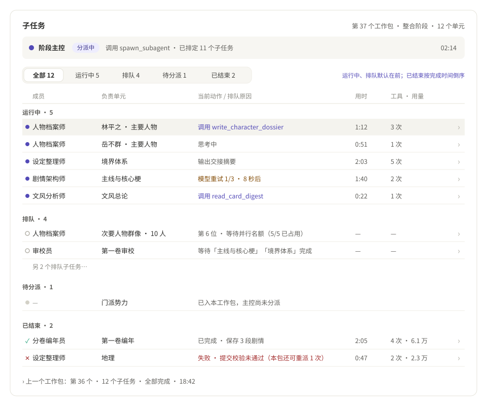
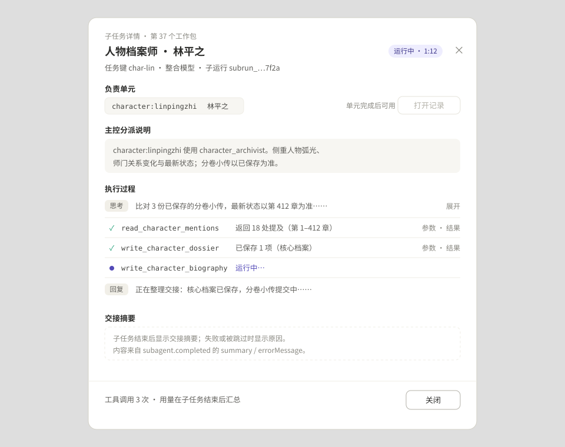

# 整书拆解子任务看板设计

> 状态：一期已实现，未提交（2026-10-04）；实现与方案的差异见末尾“实现记录”。本文回答两个问题：现有协议能否支持“看到谁在运行、谁在排队，并点开看执行详情”；如果支持，怎么改。

## 1 现状与问题

进度卡片底部的“子任务活动”是一个可折叠的字符串列表（`DecompositionProgress.vue` 的 `.decomposition-activity`），数据来自 `engine.ts` 的 `onSubagentEvent`：

```ts
const label = event.type === "subagent.completed"
  ? `${event.payload.name} · ${event.payload.status}`
  : event.payload.name;
activity.value = [...activity.value.slice(-49), label];
```

问题：

| 现象 | 根源 |
| --- | --- |
| 满屏重复的“审校员” | 除 `subagent.planned` 外的每个事件都追加一行名字，`subagent.activity` 里每个 `thinking_delta` / `message_delta` 碎片也算一行 |
| 看不到排队 | `subagent.planned` 被直接丢弃，而排队任务只出现在这个事件里 |
| 分不清哪一行对应哪个单元 | 只记名字，不记 `subagentRunId`，也不记任务说明 |
| 没有详情 | 工具调用、结果摘要、交接摘要、错误、用量都没有保存 |
| 并行时刷新过多 | 每个文本碎片都替换一次数组，5 个子任务并行时每秒触发几十次响应式更新 |
| 换包后清空 | 每个工作包开始时执行 `activity.value = []` |

计划书 §10 的运行中线框（`images/long-book-decomposition/ui-progress.svg`）原本画的是“成员 / 范围 / 当前动作 / 状态”表格，实现时简化成了这份日志。本方案按原设计补齐，并加上排队和详情。

## 2 结论：能否支持

**支持。一期只改 Renderer 和一个 contracts 纯函数，不改事件协议、Preload 和 Main。**

| 需求 | 数据来源 | 结论 |
| --- | --- | --- |
| 谁在运行 | `subagent.started` → `subagent.completed`，按 `subagentRunId` 归并 | ✅ 已有 |
| 谁在排队 | `subagent.planned` 在任何子任务启动前给出整张任务表（`index`、`key`、成员名、任务说明、`dependsOn`）；已排定但还没 started 的就是排队 | ✅ 已有，目前被丢弃 |
| 为什么排队 | `dependsOn` 非空表示等依赖；为空表示等并行名额（同一次调用最多同时 5 个，`SUBAGENT_PARALLEL_MAX_CONCURRENCY`） | ✅ 可推导 |
| 哪些单元已入包、还没分派 | 本包 `unitIds` 减去所有子任务说明里出现的单元 id | ✅ 可推导 |
| 子任务对应哪些单元 | 主控必须在任务说明里写明单元 id，`prepareChild` 用正则校验，没写就拒绝派发；Renderer 用同一规则从 `task` 文本里取出单元 id | ✅ 规则提到 contracts 后共用 |
| 执行详情：思考、回复、工具名、参数、结果摘要、错误 | `subagent.activity` 的 `thinking_delta` / `message_delta` / `tool_requested`（含 `args`）/ `tool_completed`（`resultSummary` 最多 4000 字、`isError`） | ✅ 已有 |
| 模型重试 | `subagent.activity` 的 `turn_started` / `retry_scheduled` | ✅ 已有 |
| 交接摘要、失败原因、跳过 | `subagent.completed` 的 `status` / `summary` / `errorMessage` | ✅ 已有 |
| 子任务用量 | `subagent.completed.usage` | ⚠️ 只在子任务结束时给出。运行中每轮的 `agent.usage_observed` 只交给 Main 记账，不转发给 Renderer（`main/index.ts` 只广播主控自己的工具轮次）。一期运行中显示工具次数，结束后显示用量 |
| 阶段主控在做什么 | `startExtrasAgentTask` 已有的 `onTurnStarted` / `onThinking` / `onToolRequested` / `onToolCompleted` / `onRetryScheduled`，以及 `waitingForSlot` | ✅ 已有 |
| 应用重启后、或更早工作包的执行过程 | 事件不落盘，`engine` 只在工作台功能宿主的内存里 | ❌ 一期不支持，见 §8 二期 |
| 单独停止或重派某一个子任务 | `session.abort` 只能停止整次运行；`spawn_subagent` 没有单任务取消 | ❌ 不做。单元级“重试”在工作包结束后照旧可用 |
| 查看子任务收到的完整材料（证据包） | `brief` 在 Agent Utility 的 `prepareChild` 里组装，`subagent.started.task` 只带主控写的任务说明 | ❌ 不做。证据包很大，不应经过 IPC |

## 3 状态模型

一个单元从排队到完成，经过以下几层。看板按这几层分组，单元表的状态列保持不变：

| 层 | 显示 | 判定 | 数据 |
| --- | --- | --- | --- |
| 任务等槽位 | 主控条：“等待模型并发名额” | 整次运行因 `agent.extras_capacity_reached` 退避 | `engine.waitingForSlot`（已有） |
| 单元待调度 | 单元表：待处理 | 依赖未完成，或还没轮到它进入工作包 | `job.units[id].status === "pending"`（已有） |
| 待分派 | 看板：待分派 | 已在本工作包（Core 标为 running），但没有任何子任务说明提到它 | 本包 `unitIds` − 已映射单元 |
| 排队 | 看板：排队 + 原因 | 出现在 `subagent.planned`，尚未 started | `dependsOn` → “等待「…」完成”；否则 → “第 n 位 · 等待并行名额” |
| 运行中 | 看板：运行中 + 当前动作 | started 之后、completed 之前 | 最后一个进行中的工具 → “调用 X”；否则按最后一步显示“思考中”或“输出交接摘要”；有 `retry` 时显示“模型重试 n/3 · x 秒后” |
| 已结束 | 看板：已结束 | `completed` / `error` / `aborted` / `skipped` | `summary` / `errorMessage` / `usage` |

说明：

- 只有一个任务的 `spawn_subagent` 不发 `planned`，直接 started，看板照常显示。
- 主控可以多次调用 `spawn_subagent`（例如重派失败任务）。每次调用有自己的 `parentToolCallId`，看板把它们拍平成一张表；重派后的子任务是新的一行，旧行留在“已结束”。
- 一个单元在本包最多分派两次（`prepareChild` 的 `dispatches` 限制）。单元表的“执行”入口指向它最近一次的子任务。

## 4 界面

### 4.1 子任务看板

替换现有的 `<details class="decomposition-activity">`，放在进度表格下方、同一张卡片内。



- **主控条**：圆点、“阶段主控”、状态胶囊（分派中 / 核对进度 / 查询资料 / 思考中 / 重试中 / 等待模型并发名额 / 已结束）、当前工具或计数、本包用时。工具名到状态的映射：`spawn_subagent` → 分派中，`get_decomposition_status` → 核对进度，`plan_decomposition_topic` → 规划专题，其他 `read_*` / `list_*` / `search_*` → 查询资料。
- **筛选**：复用 `.decomposition-segmented`：全部 / 运行中 / 排队 / 待分派 / 已结束，各带计数。选中的筛选只存在组件状态里，换工作包时保留。
- **表格列**：成员 | 负责单元 | 当前动作 / 排队原因 | 用时 | 工具 · 用量 | 展开箭头。
  - 负责单元用现有的 `decompositionUnitLabel` 显示可读名（人物名、卷名、类别名）。多单元任务显示前两个，再加“等 n 个”；鼠标悬停显示全部。
  - 用时复用 `ConversationRunClock`，只有运行中的行每秒刷新。
  - 排序：运行中按开始时间，排队按 `index`，已结束按完成时间倒序。
- **整行可点**，打开详情弹窗；行内用 `<button>` 承载，可用键盘聚焦。
- **上一个工作包**：底部保留最近两个已结束工作包的折叠行，展开后是同样的表格。
- **空状态**：主控还没派发时，表格区显示“主控正在规划本包的子任务”，不显示空表头。
- 没有任务（未开始或已完成）时整块不渲染，与现在一致。

### 4.2 执行详情弹窗



- 用 `Teleport` 弹窗，样式沿用 `DecompositionRecordDialog`。弹窗打开期间，子任务状态和过程实时更新。
- **标题区**：成员 · 主单元名；右上角实时状态胶囊与用时；副标题显示任务键、所用模型（阅读模型或整合模型）和缩短的子运行 id。
- **负责单元**：单元 id 与可读名的标签。单元完成后，“打开记录”调用现有的 `readUnit`，打开 `DecompositionRecordDialog`。
- **主控分派说明 / 执行过程 / 交接摘要**：直接复用聊天侧的 `SubagentRunDetail.vue`。它已经能渲染思考（可折叠）、工具调用（参数和结果摘要可展开）、流式回复、重试等待、交接摘要和错误，不在拆书页另写一套。
- **底部**：工具次数，结束后加上 `subagentUsageLabel` 的用量；“关闭”按钮。
- 排队中的子任务也能打开，显示任务说明和排队原因，执行过程为空。

### 4.3 单元表联动（可选，一期建议做）

- 单元表加一列“执行”：本包内运行中的单元显示“人物档案师 · 运行中”，排队的显示“排队”，点击打开同一个详情弹窗。
- 状态列上方加一组筛选：全部 / 进行中 / 失败与冲突 / 待处理 / 已完成。上千个单元分页显示时，这组筛选能直接找到正在跑和出问题的单元。

### 4.4 视觉与交互守则

- 颜色只用主题变量：运行中 `--accent`，排队用空心圆点和 `--text-tertiary`，失败用现有的 `is-danger` 胶囊，重试用 `is-warning`。
- 行高固定，状态变化不改变行高；排队转运行只是行在分组之间移动，不能闪烁或出现中间态（参考 AGENTS.md“操作一次，整页闪烁”）。
- 不加页面级 loading。看板只读，没有写操作。
- 窄窗口下“工具 · 用量”列先隐藏，再隐藏“用时”；“当前动作”单行省略，完整内容放在 `title` 里。

## 5 实现方案

### 5.1 复用聊天侧的子任务归并：`extras/agent-runtime/subagentRunTracker.ts`

聊天侧 `composables/agent-conversation/` 已经把子任务事件归并成 `AgentSubagentRun`，包括排队卡片、重试检查点回滚和按帧合并文本碎片：`handleSubagentPlanned`、`handleSubagentEvent`、`queueSubagentTextDelta` / `flushPendingSubagentTextDeltas`、`ensureSubagentRun`、`subagent-retry`。这些都是接收最小 `ctx` 的纯函数。

新增一个无界面的追踪器，按需装配这个最小 `ctx`：

```ts
export function createSubagentRunTracker(options?: { keepPackages?: number }) {
  // 每次运行（runId）对应一个响应式 ChatMessage 容器，subagentRuns 挂在上面
  return {
    packages,        // ShallowRef<TrackedPackage[]>，最新的在前，最多 keepPackages（默认 3）
    begin(meta),     // 新工作包：记录 jobId、phase、unitIds、开始时间
    handleEvent(e),  // subagent.planned/started/activity/completed
    parent,          // 主控状态：phase 胶囊、当前工具、轮次、重试
    dispose()
  };
}
```

- 放在 `extras/agent-runtime/`，其他扩展分析页以后要显示子任务时也能直接用。它只消费 `startExtrasAgentTask` 已经过滤好的事件，不重复会话、事件过滤和停止逻辑。
- 聊天侧只把几个 `ctx` 的 `Pick` 类型收窄，例如 `messageMutations` 改成只要求 `appendText`。行为不变，聊天测试保持通过。
- 文本碎片用 `requestAnimationFrame` 合帧，与聊天侧相同；看板计数和行摘要从合帧后的数据 `computed` 得出。

### 5.2 单元匹配规则共用：contracts 纯函数

把 `definition.ts` 里 `prepareChild` 的单元 id 正则提成 `packages/contracts/src/long-book-decomposition/job.ts` 的：

```ts
/** 任务说明中写明的本包单元 id；Agent 授权与 Renderer 显示共用。 */
export function decompositionTaskUnitIds(task: string, unitIds: readonly string[]): string[]
```

`prepareChild` 再按角色过滤；Renderer 从 `@deepwrite/contracts/renderer` 引入。两侧共用一条规则，避免看板显示的映射和实际授权不一致（参考 AGENTS.md：共用业务规则放 contracts 纯函数）。

### 5.3 `engine.ts` 改动

- 删除 `activity` 和 `onSubagentEvent` 里的字符串拼接。
- 每个工作包开始时调用 `tracker.begin({ phase, unitIds, startedAt })`。`onSubagentEvent` 和主控相关回调交给追踪器。
- 对外暴露 `subtasks: tracker.packages` 和 `parentStatus: tracker.parent`；切换任务（`selectJob`、`create`）时清空，`dispose` 时释放。
- 加上主控回调后，`engine.ts` 会接近 300 行的建议上限。主控状态归并放进追踪器，engine 只负责接线。

### 5.4 组件

| 文件 | 内容 | 预计行数 |
| --- | --- | --- |
| `long-book-decomposition/DecompositionSubtaskBoard.vue` | 主控条、筛选、分组表格、上一个工作包的折叠行 | ≈ 220 |
| `long-book-decomposition/DecompositionSubtaskDialog.vue` | 详情弹窗，内嵌 `SubagentRunDetail`，“打开记录”复用 `readUnit` | ≈ 120 |
| `long-book-decomposition/subtask-board.ts` | 纯函数：分组与排序、排队原因、当前动作、单元标签、主控状态文案 | ≈ 150 |
| `DecompositionProgress.vue` | 删除 `<details>`，接入看板；单元表加“执行”列（§4.3） | 252 → ≈ 250 |
| `decomposition-tables.css` | 删除 `.decomposition-activity`，加看板样式 | 204 → ≈ 280 |
| i18n `extras/long-book-decomposition/{zh-CN,en}.ts` | 看板文案；删除 `activity` 键 | — |

### 5.5 内存与性能

- 只保留最近 3 个工作包的完整过程，更早的丢弃。一个工作包最多 20 个单元，通常不超过 20 个子任务。提交工具的 `args` 可能有几十 KB（阅读记录），3 包合计在几 MB 以内。
- 列表行只读取轻字段（状态、名字、单元、最后一步），不读 `processingSteps` 正文。详情只在弹窗打开时渲染一个子任务。
- 这些事件现在已经全部经过 IPC 到达 Renderer，本方案不增加任何事件流量。

## 6 不改的部分

- 事件协议（`packages/contracts/src/session/subagent.ts`）、Preload、Main 路由、Agent Utility 和 `pi-runtime-adapter` 的调度逻辑都不变。`definition.ts` 只改为调用 contracts 的匹配函数。
- 单元状态机、工作包选取（`readyDecompositionUnitIds`）、重试与跳过语义不变。

## 7 测试与验收

| 层 | 内容 |
| --- | --- |
| contracts | `decompositionTaskUnitIds`：前后缀边界（`character:a` 不匹配 `character:ab`）、大小写、特殊字符转义；`definition.test.ts` 改用它后仍通过 |
| 追踪器 | planned → 排队；started 接管对应排队行；文本碎片在一帧内只更新一次；重试回滚；completed 的 summary/error/usage；单任务调用没有 planned；同一单元重派出现两行；只保留 3 个工作包 |
| `subtask-board.ts` | 分组计数；排队原因（依赖 / 并行名额）；待分派 = 本包单元 − 已映射单元；当前动作文案 |
| engine | 删除 `activity` 后的现有用例；新包开始时调用 `begin`；切换任务时清空 |
| 界面 | 按 `decomposition-page-restyle` 的浏览器预览方式：真实 `useLongBookDecomposition` + 假 api，按时间注入一组 planned/started/activity/completed 事件。用 `requestAnimationFrame` 逐帧采样行数、行高和分组计数：排队转运行没有中间态，行高不变，5 个并行子任务流式输出时帧率不下降。检查浅色、深色、自定义强调色和紧凑窗口 |
| 桌面 | 用 Faux 模式（`fauxDecompositionParent` / `fauxDecompositionChild`）跑一个小样本，确认真实事件链能驱动看板。按用户此前的要求，不对本机《剑出衡山》跑拆书 |

## 8 二期（可选）：执行记录落盘

需要在重启后回看执行过程时再做：

- Main 已经按任务累计用量（`main/decomposition-usage.ts`），在下一次 `longBookDecomposition.control` 时交给 Core（`extras/agents/long-book-decomposition/commands.ts`）。执行记录照这个模式：Main 在 `subagent.started` / `subagent.completed` 时为该任务收集精简条目（成员、单元 id、状态、起止时间、用量、错误、截断后的交接摘要、工具名与次数），随 `finish-package` 交给 Core，写入 `long-book-decomposition-jobs/<jobId>/runs/<attemptId>.json`。
- 需要新增一个只读命令 `longBookDecomposition.listRuns`（contracts → Preload → Main 路由 → Core），看板的“更早工作包”从这里读取。
- 只存摘要，不存思考和工具参数全文。回看时详情弹窗显示结果，不显示过程。
- 代价：一个新命令、一个存储文件和一处 Main 观察点。一期上线后如果确实需要回看，再开工。

## 9 实现记录（2026-10-04）

一期按 §5 落地，与方案不同或未做的地方：

| 项 | 实现 |
| --- | --- |
| 追踪器 | `extras/agent-runtime/subagentRunTracker.ts`，复用聊天侧归并函数。聊天侧只做了两处类型收窄（`subagent-events.ts`、`subagent-text-deltas.ts` 的 `messageMutations` 只要求 `appendText`）和一处抽取（`turn-retry.ts` 的 `agentRetryMetadata`，不依赖会话上下文），行为不变 |
| 共用匹配规则 | `decompositionTaskUnitIds` 在 `contracts/long-book-decomposition/job.ts`，Renderer 经 `contracts/renderer.ts` 引入；`definition.ts` 的 `prepareChild` 已改用它 |
| 看板 | `DecompositionSubtaskBoard.vue`（主控条、筛选、上一个工作包）、`DecompositionSubtaskTable.vue`、`DecompositionSubtaskDialog.vue`、`subtask-board.ts`（纯函数）、`decomposition-subtasks.css`；`DecompositionProgress.vue` 删掉了旧的日志列表 |
| 表格 | 实现为带 ARIA 角色的 CSS 网格行，而不是 `<table>`。分组标题要横跨整行，同时窄屏要隐藏“用时”“用量”列；`<table>` 的跨列单元格会让被隐藏的列留下空白列宽，网格没有这个问题 |
| 空包 | 一个工作包没派出任何子任务就结束（例如等模型并发名额），下个包开始时直接丢弃，不在“上一个工作包”里占位 |
| 切换任务 | 任务 id 变化且当前没有在运行时清空看板；运行中的包保留自己的看板 |
| 未做：§4.3 | 单元表的“执行”列和状态筛选没有做。需要把“当前打开的子任务”提升到控制器，建议和二期（落盘）一起评估 |
| 未做：二期 | 重启后回看执行过程仍未做，见 §8 |

验证：契约、追踪器、看板纯函数、engine 集成和页面结构共新增 17 项测试；全量 `pnpm test` 4558 项通过，另有 `long-book-source-commands` 的一个用例在全量并发时超时，单独运行通过，与本改动无关。界面用 scratchpad 里的临时预览（真实组件与追踪器，注入事件）在浏览器窗格检查了：运行/排队/待分派/已结束分组、详情弹窗随流式输出和结束实时更新、排队转运行的帧采样（行数、行高、表高无中间态）、浅色与深色主题、容器宽 472 / 562 / 922 三档的列隐藏。没有对真实模型和本机书籍跑过拆书。
