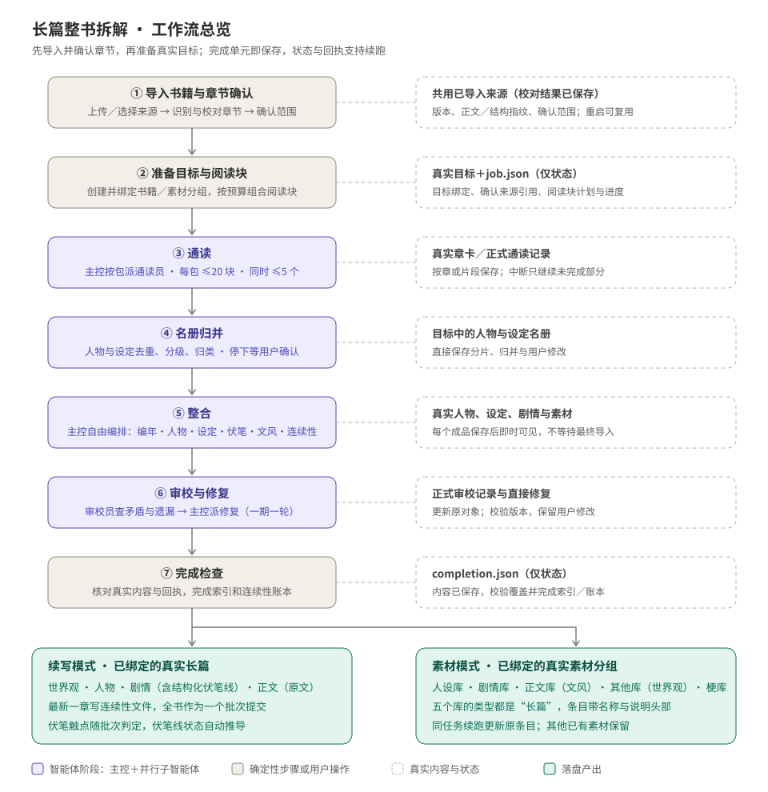
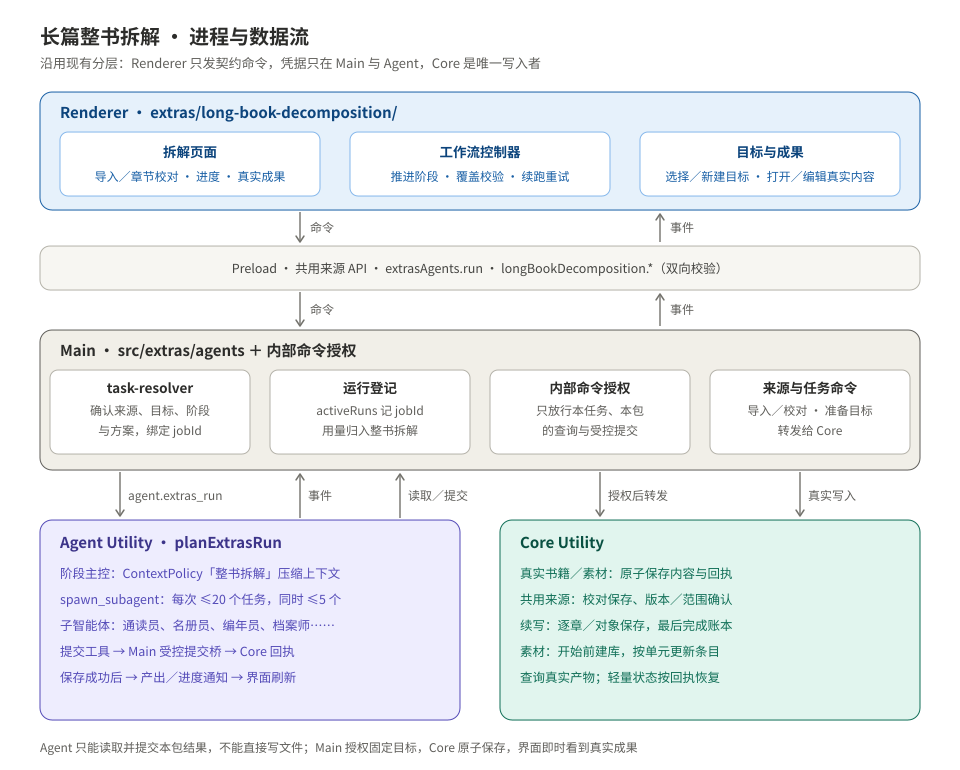
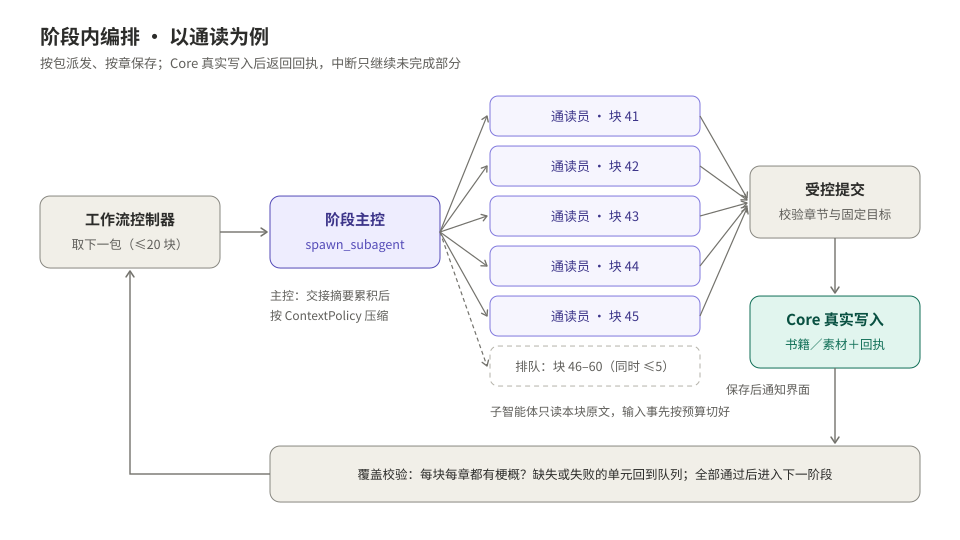
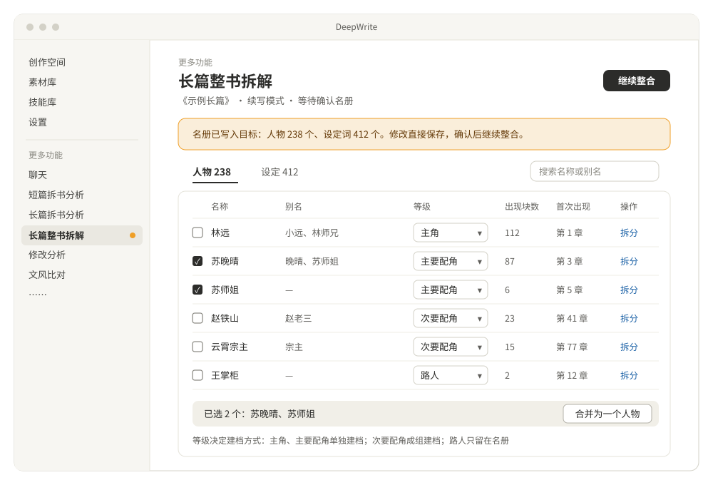
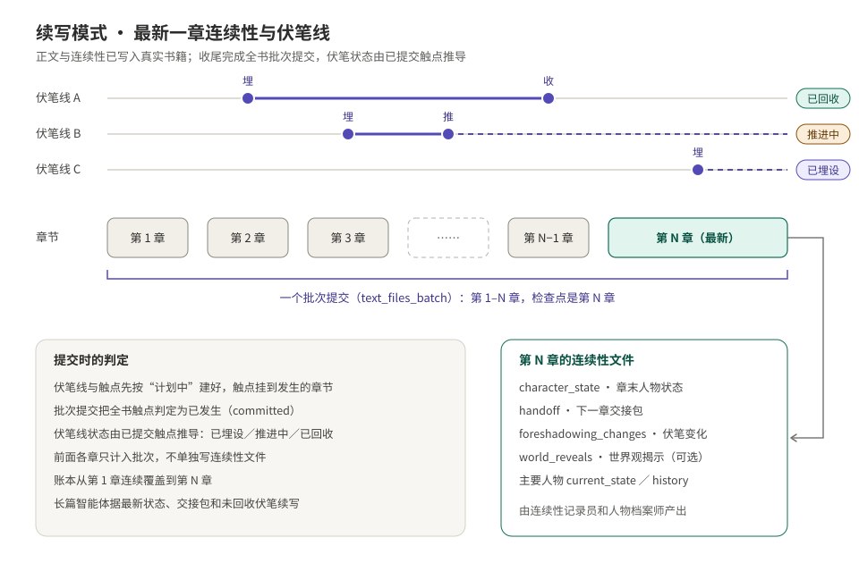
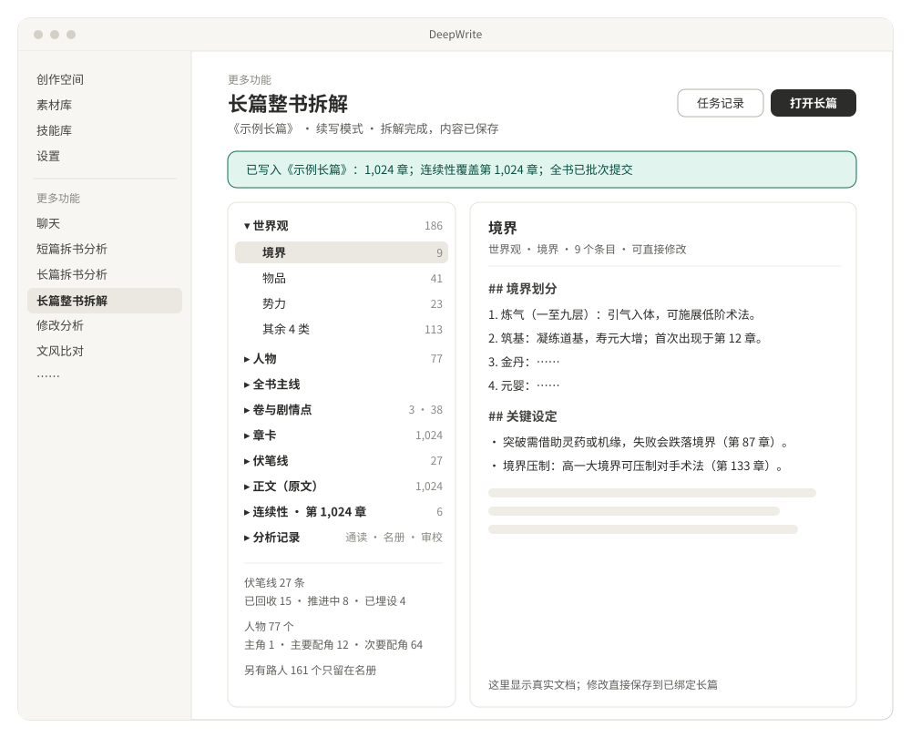
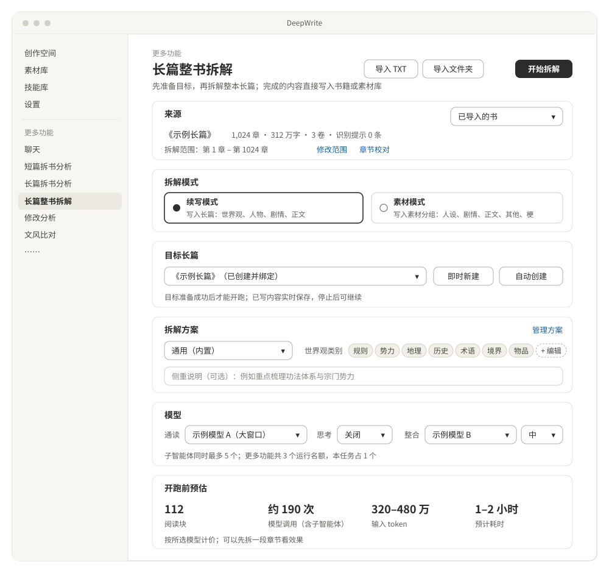
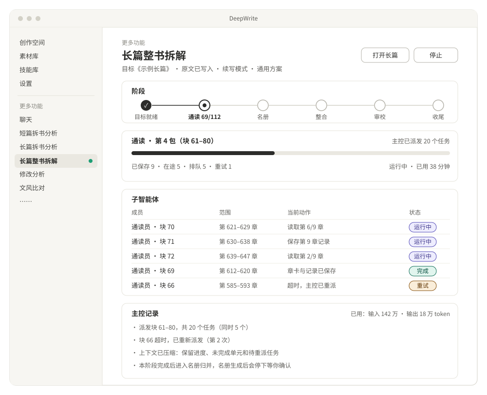

# 长篇整书拆解计划书

> 状态：设计已确认，尚未开工（2026-10-01）。本文是实现依据；实现时如需偏离，先改本文再改代码。

> 写入约定：开始拆解前，目标长篇或素材库分组及对应素材库必须已经创建成功，并与任务持久化绑定。支持选择已有目标、在当前页即时新建，或按来源书名自动创建。拆解过程中，完成的单元直接写入真实书籍或素材库，并记录状态；不设任务结果暂存区，也不在结束时统一搬运成品。

## 1 背景与目标

“更多功能”新增「长篇整书拆解」，与「长篇拆书分析」并列，不替代它。

| | 长篇拆书分析（已有） | 长篇整书拆解（新） |
| --- | --- | --- |
| 范围 | 一次最多连续 50 章 | 整本书，几百到几千章，可选章节范围 |
| 目的 | 按预设提炼写作方法 | 重建作品本身的内容资产 |
| 产出 | 每个预设一篇 Markdown，存成一条素材或技能 | 续写模式：一本创作空间长篇；素材模式：一个素材库分组 |
| 运行 | Renderer 串行运行 batch → reduce → final 一次性任务 | 确定性工作流 + 阶段主控 + 并行子智能体 + 压缩 |

- **续写模式**：开始前选定或创建一本创作空间长篇，运行中逐步填好世界观、人物、剧情、正文四个阶段，正文就是原文。最新一章写好连续性，伏笔建成伏笔线，完成后创作空间的长篇智能体可以直接写下一章。
- **素材模式**：开始前选定或创建一个素材库分组并备齐对应素材库，运行中把通读记录、名册、剧情、人物、文风、世界观（境界、物品等）和核心梗直接保存为真实素材条目。

一期目标：

- 支持 TXT 或按章整理的文件夹，整本或指定章节范围。
- 开跑前必须创建或选定目标，并保存目标 ID；目标未准备好时不调用模型。
- 开跑前给出预估；可以停止、断点续跑；运行中可查看已写入内容，完成后直接在真实目标中检查和修改。
- 通读和名册与模式无关，换一种模式只需重跑整合。

一期不做：合并或覆盖非空长篇、覆盖已有素材条目、连载更新后的增量拆解、故事事件与叙事放置、用户自定义子智能体或工具、新增素材类型。已有空长篇可作为目标，已有素材分组可追加；续跑可继续处理本任务已经写入的部分。

## 2 已确认的决定

| # | 决定 | 说明 |
| --- | --- | --- |
| 1 | 子智能体由主控自由编排 | 角色和工具由开发者定义；主控决定派几个、怎么分组、依赖和重派，并能用通用拆解员开临时专项；用户不能自定义角色 |
| 2 | 续写模式只做最新一章的连续性 | 全书各章组成一个 `text_files_batch` 批次提交，连续性文件只写在最新一章 |
| 3 | 伏笔建成结构化伏笔线 | 伏笔线和触点挂到具体章节，随批次提交判定为已发生，伏笔线状态自动推导 |
| 4 | 素材映射 | 文风进正文库，世界观进其他库、一个类别一条；不新增素材类型，不影响双端同步 |
| 5 | 开跑前准备并绑定目标 | 两种模式都支持选择已有目标或即时/自动新建；默认每本书新建目标，同任务续跑不重复创建 |
| 6 | 运行中直接写入真实目标 | 每个完整单元通过校验后立即由 Core 写入书籍或素材库，再记录完成；任务记录只保存状态与真实内容引用 |

决定 2、3 取代了此前“续写模式不做连续性”的方案。

决定 5、6 取代“拆解完成后才创建目标、预览确认后统一落盘”的方案。提前创建的是实际项目与库；阅读卡、名册、成品、审校记录都直接保存在真实目标中，不维护另一套待导入结果。

以下默认值实现时照此处理，可以再调整：

- 通读和整合可以分别选模型，默认用同一个。
- 名册生成后默认停下等用户确认，可勾选“自动继续”。
- 素材模式另外产出梗库。
- 主控运行强制开启运行内压缩，预算和摘要模型沿用设置页（理由见第 7 节）。

## 3 总体设计



| 层 | 负责 |
| --- | --- |
| 工作流（代码） | 切分、推进阶段、覆盖校验、单元状态、续跑、重试、运行名额等待 |
| 阶段主控（智能体） | 在一个工作包内编排子任务：数量、分组、依赖、重派、临时专项 |
| 子智能体 | 读取与提交完整结构化产出；工具固定，由 Main 授权 Core 将结果写入已绑定的真实目标 |

不让一个主控从头跑到尾：几千章的任务要跑几十分钟到几小时，中途崩溃会丢掉全部进度，也无法保证每一章都被读到。每个工作包是一次独立的扩展运行，结束后由工作流校验覆盖，缺失的单元进入下一包。

几条关键性质：

- **一次通读，两种产出**：阅读卡和名册与模式无关。先跑素材模式，以后要续写版本只需重跑整合，而通读占成本的大头。
- **单元完成即落盘**：中断只损失在途单元。
- **覆盖由代码校验**：每章有梗概、每个必需成品都齐全，不依赖主控自觉。
- **目标先存在**：首次模型调用前，Core 已完成目标创建或已有目标校验，任务状态已保存目标绑定；续跑始终使用这些 ID。
- **完成即真实写入**：阅读记录、名册、成品和审校记录都写入书籍或素材库，随写随可见；最后只校验完整性和完成连续性账本，不再导入一遍。
- **保存成功才算完成**：Core 持久化真实内容和写入回执后，提交工具才能返回成功，工作流才能把单元标为完成。

## 4 进程与数据流



| 层 | 职责 | 主要位置 |
| --- | --- | --- |
| Renderer | 页面、目标选择与即时新建、工作流控制器（发起每个工作包的运行）、名册确认、真实成果查看与编辑 | `apps/desktop/src/renderer/src/extras/long-book-decomposition/` |
| Preload | `extrasAgents.run`（已有）与新的 `longBookDecomposition.*`，请求与响应双向校验 | `apps/desktop/src/preload/long-book-decomposition-api.ts` |
| Main | 建任务（来源、方案、模型容量、切分）、目标准备与注册表解析、任务解析、运行登记、内部命令授权、直接写入转发与回执 | `apps/desktop/src/extras/agents/`、`src/main/` |
| Agent Utility | 主控与子智能体运行、工具、压缩、Faux | `packages/pi-runtime-adapter/src/extras/agents/long-book-decomposition/` |
| Core Utility | 任务状态原子读写、目标创建/校验与绑定、真实内容查询、按单元写入长篇/素材与批次提交 | `apps/desktop/src/utilities/long-book-decomposition/` |

### 4.1 边界约束

这些约束都来自 AGENTS.md：

- Renderer 只从 `@deepwrite/contracts/renderer` 引入契约运行时值，不引入 Pi 或 adapter。
- 智能体只走扩展域：`extrasAgent.run` → `agent.extras_run` → `planExtrasRun`。不向 `session.prompt` 载荷或 `WorkspaceRuntimeContext` 加字段。
- 档案（拆解方案）由 Main 权威解析：
  - 建任务时，从 `ExtrasAgentConfigStore` 解析方案并写入任务快照。
  - 之后每次运行都由 Main 从任务快照取方案；Renderer 传的 `profileId` 必须与快照一致。
- 智能体读取状态与真实目标内容只经 Main 授权的 Core 只读桥；提交结果经专用的受控提交桥。所有写入由 Core 原子完成，Agent 不直接写文件。
- 新增的内部命令全部加入 `src/main/ipc/forbidden-commands.ts`，Renderer 不能直接发送。包括 Main→Core 的任务状态、目标写入命令和 Agent 的查询/提交命令。
- Renderer 只传目标选择或新建请求及资源 ID；Main 从项目注册表解析实际路径，Agent 不决定写入目标。目标与任务的持久化绑定由 Core 管理。
- “开始拆解”授权本任务在绑定目标中新建并持续更新它管理的内容；生成结果通过 schema 校验后自动写入，不逐条要求用户批准。对用户后来手改的内容必须做版本校验，冲突时暂停对应单元，不自动覆盖。

### 4.2 数据流

1. **建任务并准备目标**
   - Renderer 发 `longBookDecomposition.createJob`，携带目标选择：已有长篇/分组 ID，或新建目标的名称与方式。
   - Main 依次处理：读取已导入来源（`LongBookAnalysisSourceStore`）→ 解析方案 → 读取两种模型的容量 → 用契约里的纯函数生成切分计划。
   - Core 先写入轻量任务状态，阶段为 `prepare_target`；保存来源 ID/指纹、目标准备操作标识、新建资源的稳定 ID 及所需步骤，再调用既有长篇与 catalog 创建能力。任务记录不复制原文或分析结果。
   - 选择已有目标时，Main 从注册表解析路径，Core 校验目标、素材库类型和基准版本；新建目标时，Core 创建并注册真实项目。素材模式在开跑前备齐人设、剧情、正文、其他、梗五个库。
   - 续写模式还在真实长篇中建立源文卷、章卡与 `body.md`，原文直接作为正文保存。素材模式沿用已导入来源的持久化存储，未完成任务引用期间不能删除来源。
   - Core 保存绑定结果和准备步骤，目标状态为 `ready` 后才允许阶段进入 `read`。创建失败时保留准备记录供重试，不能调用模型。
2. **运行一个工作包**
   - Renderer 用 `startExtrasAgentTask` 发 `extrasAgent.run`，任务为 `{ agentId: "long-book-decomposition", profileId, input: { jobId, phase, unitIds } }`。
   - Main 的 `task-resolver` 做以下事：
     - 让 Core 打开任务：校验阶段、单元未完成、方案一致、目标已绑定且存在；Core 同时记住这个 jobId 对应的目录。
     - 附上方案快照和模式。
     - 在运行登记里写入 `decompositionJobId`。
3. **读取**
   - Agent 的读工具发出 `longBookDecomposition.query`，经 supervisor 白名单到 Main 授权。
   - 授权条件：运行已接受、jobId 与运行一致、`parentRequestId` 是该运行的请求。
   - 通过后 Core 读取轻量状态、真实目标中的阅读记录与成品；原文来自真实长篇正文或已有来源存储。
4. **产出**
   - 子智能体提交工具调用 `longBookDecomposition.submitUnit`，经 Main 校验 jobId、运行/尝试标识、单元键及绑定目标，按目标串行交给 Core。
   - Core 校验产出后，通过现有长篇事务或 catalog 写入机制将内容直接写入真实目标，并在同一目标事务中保存单元回执；回执只含 ID、输入版本、结果版本/校验值，不存结果副本。
   - Core 更新任务状态并返回持久化回执，提交工具此时才返回成功，随后发出 `extras_agent.output_updated` 与既有项目更新事件供界面刷新。事件只负责通知，不能作为保存成功的依据。
   - Renderer 刷新、繁忙或退出不影响已经保存的真实内容；恢复时可用目标回执补齐尚未来得及更新的任务状态。
5. **覆盖校验**：运行结束后，控制器向 Core 取单元状态，决定下一包、重试还是进入下一阶段。
6. **完成检查**：全部必需单元真实写入后校验覆盖；续写模式完成全书连续性批次提交，素材模式完成索引。展示真实成果，不再创建目标或搬运内容；见第 9 节。

## 5 工作流

### 5.1 阶段与单元

| 阶段 | 单元 | 单元来源 | 完成条件 |
| --- | --- | --- | --- |
| prepare_target | 目标校验/创建、素材库补齐、源文章卡与正文、持久化绑定 | 目标选择与模式 | 真实目标已存在、已注册，必需准备步骤及绑定记录已保存 |
| read | `chunk:<n>` 阅读块，可细分为章节/片段检查点 | 切分计划 | 本块每章的正式阅读记录已写入目标，均有梗概 |
| registry | `registry:part:<n>` 分片、`registry:merge` 合并 | 按阅读记录里的名字数量分片 | 正式名册已写入目标，每个名字有归属或被标为忽略 |
| registry_review | 用户确认 | — | 用户点“继续整合”，或已设自动继续 |
| integrate | 必需成品键（见 8.5） | 由名册、编年段、模式确定 | 每个必需键都能定位到目标内已保存的真实成品 |
| review | `review:<领域>`、修复任务 | 审校结果 | 审校记录已写入目标；问题已修复或保留为提醒，一期一轮 |
| finalize | 覆盖校验、索引、连续性批次提交 | 真实内容与写入回执 | 见第 9 节；全部内容已经写入，无待导入结果 |
| done | 真实成果查看 | — | 运行完成；仍可在创作空间或素材库编辑 |

### 5.2 状态

- 任务状态：`idle`、`running`、`stopped`、`failed`、`completed`，与阶段字段分开记录。
- 停止、失败或应用重启后，已经写入书籍/素材库的内容全部保留；“继续”从当前阶段未完成的章节、片段或成品开始。
- 目标准备中断时，先根据已保存的操作标识和资源 ID 查回已创建目标，补齐未完成步骤；同任务重试不得生成第二本书、第二个分组或重复素材库。
- 停止或失败后保留目标绑定。恢复时按资源 ID 从注册表重新解析路径，不按书名猜测目标；目标缺失或版本冲突时暂停写入，分析成果仍保留。
- 重跑整合：复用真实目标中的阅读记录和名册，不清空已写入内容。模式、方案或目标变更时先准备新的输出版本与目标；同版本的失败重试继续更新原单元，显式重跑采用新目标或在素材分组中追加新版本条目。

### 5.3 切分规则

- **预算**：沿用拆书分析的口径，单块输入预算 =（窗口 − 输出预留 − 工具与角色说明预留 − 提示词）× 0.6，用保守权重估算（中文 1.5 token/字）。
- **上限**：每块不超过 20 章、60k 估算 token。大窗口模型也不再加大，以保证阅读卡的质量。
- **不跨卷**。
- **超长单章**：按段落优先切成多个片段块，阅读卡标注片段序号；章卡梗概按片段顺序拼接。
- **计算位置**：计划由契约中的纯函数生成——Renderer 用它预览，Main 建任务时权威计算，结果写入 `job.json`。
- **锁定**：通读开始后锁定切分；在此之前更换通读模型会重新切分。

### 5.4 工作包与并发

- 每次运行处理一个工作包：通读阶段最多 20 块，整合阶段最多 20 个依赖已就绪的必需键。
- 一个任务同时只有一个运行，占 1 个扩展运行名额（共 3 个）。子智能体同时最多 5 个（`SUBAGENT_PARALLEL_MAX_CONCURRENCY`）。
- 名额已满（`agent.extras_capacity_reached`、`agent.capacity_reached`）时，等待 3 秒后重试，沿用 `preset-batch` 的做法。
- **单元失败**：
  1. 主控在本次运行内可以重派一次。
  2. 运行结束后仍未完成的单元，由工作流放回队列。
  3. 累计失败 3 次，标记失败并暂停任务，提示换模型或跳过。
  4. 只有阅读块可以跳过；预览中会标出缺梗概的章节。



### 5.5 名册确认



- **人物**：改等级、合并、拆分、改规范名、忽略误识别的名字。
- **设定词**：改类别、合并、忽略。
- **等级决定整合方式**：主角、主要配角单独建档；次要配角由主控按每组最多 10 人派任务，每人仍有一份简档；路人只留在名册。
- **保存**：直接更新真实长篇中的正式名册记录或素材分组里的名册条目，并记录内容版本与用户修改。原始名字到名册 id 的映射（`nameIndex`）由 Core 按别名推导，不由模型直接写。

### 5.6 开始前的目标准备

- **续写模式**：目标选择框列出已有空长篇，支持在当前页即时新建，也可按来源书名自动创建。空长篇允许保留系统初始化的空结构，不能含用户已写正文、人物或设定；本任务续跑使用它已绑定的长篇。
- **素材模式**：选择已有素材分组，或在当前页即时/自动新建。开跑前校验并备齐人设、剧情、正文、其他、梗五个库，类型为“长篇”；已有兼容成员库复用，缺少的库由 Core 新建并加入分组。
- **已有内容**：素材条目采用追加，不按名称覆盖；已有库介绍保留，随写入增加本任务条目索引。含其他内容的长篇合并规则留到二期，不自动清空用户内容。
- **开始门槛**：目标校验/创建、项目注册、绑定记录都成功后才调用第一个智能体。未选目标、创建失败、类型不匹配或绑定未保存时，开始操作只进行目标准备，不进入通读。
- **绑定稳定**：通读开始后锁定当前输出版本的目标。改目标需要先停止并显式创建新的输出版本；可复用已保存的通读和名册，不能在运行中偷偷切换写入目标。
- **操作归属**：目标创建复用现有长篇与 catalog 存储机制；智能体只产出拆解数据，不调用建书、建库或选择目标工具。

### 5.7 直接写入与恢复规则

- 单元状态按 `pending → running → writing → done` 推进；真实内容和目标内回执持久化成功后才能进入 `done`。任务状态文件与目标文件跨目录时，用目标内回执恢复状态，不能声称一次文件重命名能完成跨项目事务。
- 重复提交按 `jobId + outputVersion + unitId + inputRevision` 查回已保存结果；同输入的重试返回原回执，不再创建人物、章卡、素材条目或账本记录。物理资源 ID 在执行写入前确定并保存。
- 通读以一章为默认提交检查点，超长章按片段提交。已完成章节/片段直接进入正式阅读记录；本块中断后只派未完成部分，不因 `finish_reading_card` 尚未调用而丢掉整块。
- 人物分卷小传、名册分片、审校问题也是正式记录，完成后立即保存。后续合并从这些真实记录读取，不能只依赖主控上下文。
- 恢复时先修复目标项目已有事务，再校验目标回执与内容版本；补齐“真实内容已保存但任务状态未更新”的单元，将失去活跃运行的在途单元重新排队。主动停止不增加失败次数。
- 旧运行或旧输入版本的迟到提交被拒绝；同一真实对象的写入由 Core 串行处理，不依赖模型自行避免冲突。
- 用户修改过某个生成条目时，后续写入须校验对象版本/正文校验值；不一致就标为 `conflict` 并暂停该单元。其他不冲突单元可继续，恢复时不能自动清空或覆盖用户修改。
- 项目基准版本随本任务成功写入推进；并行单元校验各自对象/区块的内容版本，不把本任务对其他对象的正常更新误判为用户冲突。
- 最后一步失败只重试未完成的覆盖校验、索引或账本步骤；已经存在的真实内容不再重新生成、重新导入。

## 6 智能体与子智能体

### 6.1 扩展智能体 `long-book-decomposition`

- 是一个 `ExtrasTaskAgentDefinition`（一次性任务），按 `input.phase` 生成不同的运行边界、用户消息和工具。
- 用户消息只描述工作包：阶段、单元列表、已就绪的依赖。数据都通过工具读取。
- `profilePrompt: "data"`：方案里的“侧重说明”作为任务数据交给主控，由主控写进子任务说明，不进入系统提示词。系统提示词只有【整书拆解运行边界】。
- 每个阶段都提供确定性的 Faux 步骤（主控派发 → 子任务提交固定结构的产出），用于评测模式和测试。

需要给扩展域补的通用能力（不依赖创作空间的团队配置）：

| 能力 | 改动 |
| --- | --- |
| 任务型运行可派子智能体 | `ExtrasTaskAgentDefinition` 增加 `orchestration?(task, services)`，返回角色定义 `RuntimeSubagentDefinition[]` 和 `prepareChild`（按角色给工具与提示词）；`planExtrasRun` 在 `build()` 中用运行上下文的 `spawnStreamFn`、`parentSignal`、`getParentMessages` 组装 `spawn_subagent`，`parallel: true` |
| 并行但不暴露任意作品写入范围 | `BuildSpawnSubagentToolInput` 增加 `writeScopeMode: "none"`，不向模型开放创作域 `write_scope` 或通用写文件工具。专用提交桥只能写本任务固定目标及本包单元，由 Main/Core 授权、串行化并校验版本；不能仅依赖工具名白名单判断写入权限 |
| 持久化提交回执 | `ExtrasAgentRunServices` 注入专用提交执行器，提交工具等待 Core 保存成功后返回。子任务完成事件、产出通知都不代替真实写入回执 |
| 子任务产出回传 | `subagent-events.ts` 的子任务事件白名单加入 `extras_agent.output_updated` |
| 任务型运行压缩 | 定义可声明 `contextTask` 与工具压缩器；`planExtrasRun` 为任务型运行建立 `ContextPolicy`（目前只给对话型） |
| 子任务进度给页面 | `startExtrasAgentTask` 回调增加 `onSubagentEvent`，接收 `subagent.planned / started / activity / completed` |

### 6.2 主控

| 工具 | 说明 |
| --- | --- |
| `get_decomposition_status` | 本包单元、依赖成品是否就绪、名册与编年段统计 |
| `list_registry` | 分页列出人物或设定词（等级、类别、出现块数） |
| `read_card_digest` | 指定范围阅读卡的摘要（每章梗概和名单，不含片段） |
| `spawn_subagent` | 派发子任务；每次最多 20 个，同时最多 5 个 |

主控边界要点：

- 只编排，自己不写成品；本包每个单元都要派到，任务说明要写清单元 id、章节范围和依赖。
- 主控没有原文读取工具，避免上下文膨胀。
- 子任务失败可以重派一次，仍失败就在最终回复里列出，交给工作流处理。
- 可以用通用拆解员开专项，比如功法体系、感情线；专项产出不计入必需键。
- 主角这类贯穿全书的对象，可以先按卷派小传任务，再派一个合并任务。

### 6.3 子智能体角色

| 角色 | 阶段 | 输入 | 读取工具 | 提交工具 | 产出 |
| --- | --- | --- | --- | --- | --- |
| 通读员 `reader` | read | 一个阅读块中未完成的章节/片段 | `read_chunk_text`、`search_chunk` | `submit_chapter_reading`、`finish_reading_card` | 每章/片段完整阅读记录，Core 汇总为阅读卡 |
| 名册员 `registrar` | registry | 名字提及（分片） | `read_mentions`、`search_cards` | `submit_registry_part` | 名册分片；合并任务产出完整名册 |
| 分卷编年员 `chronicler` | integrate | 一个编年段的阅读卡 | `read_cards` | `write_chronicle` | 段梗概、剧情点（含章节范围） |
| 剧情架构师 `plot_architect` | integrate（依赖编年） | 全部编年段、伏笔笔记 | `read_chronicles`、`read_foreshadowing_notes`、`search_source` | `write_book_line`、`write_foreshadowing`、`write_opening` | 全书主线、卷梗概、核心梗；伏笔线与触点；开篇分析（素材模式） |
| 人物档案师 `character_archivist` | integrate | 一个或一组人物的全部提及 | `read_character_mentions`、`search_source` | `write_character_dossier` | 一句话简介、核心档案、关系、最新状态、经历时间线 |
| 设定整理师 `world_archivist` | integrate | 一个设定类别的全部提及 | `read_world_mentions`、`search_source` | `write_world_category` | 类别概览与条目（境界按层级排序） |
| 文风分析师 `style_analyst` | integrate | 文风观察、抽样原文 | `read_style_notes`、`sample_passages` | `write_style_profile` | 文风画像、典型片段与点评 |
| 连续性记录员 `continuity_keeper` | integrate（续写，依赖人物档案与伏笔线） | 最后几块阅读卡、主要人物档案、最新一章原文 | `read_cards`、`read_assets`、`read_chunk_text` | `write_latest_continuity` | 最新一章的人物状态、交接包、伏笔变化、世界观揭示 |
| 审校员 `reviewer` | review | 成品与名册 | `read_assets`、`list_registry`、`search_source` | `report_review_issues` | 问题清单 |
| 通用拆解员 `generalist` | integrate、review | 主控写明的角色要求 | 按任务给全部读取工具 | `write_topic` | 专题成品（世界观、人物、剧情、文风之一） |

- **提交工具**：
  - 用契约 schema 校验。
  - 只能提交本包允许的单元键；通用拆解员的专题键有数量上限。
  - 通过专用提交桥直接写入真实目标，等待 Core 持久化回执后返回 `extras-agent-output` 详情，并发出通知事件。
- **通读员的提交方式**：每完成一章/片段，就把梗概、人物事实、设定、剧情与伏笔、文风作为一个完整记录提交；Core 校验并立即写入正式分析笔记/素材条目，同时更新续写模式的真实章卡。`finish_reading_card` 只校验本块覆盖并标记块完成，不再负责一次性保存全块。半章尚未提交的内容可重做，已提交章节必须复用。
- **事实来源**：每条事实带章号；推断的内容标注“推断”；伏笔只记录已经发生的埋、推、收，对未来的猜测写进伏笔线说明，不建触点。
- **子智能体的模型**：继承所在运行的模型（通读阶段用通读模型，其他阶段用整合模型）。

### 6.4 Core 只读查询

Agent 的读取工具都通过 `longBookDecomposition.query { jobId, request }` 访问 Core。每次结果不超过 12,000 字，较长的内容用游标分页。

查询沿任务的真实内容引用读取书籍/素材，必要时用契约纯函数把正式 Markdown 记录解析成结构化数据；不读取独立的结果缓存。复用另一输出版本的阅读记录时，Main 只授权状态中已登记的只读引用，写入仍限于当前绑定目标。

| 请求 | 用途 |
| --- | --- |
| `status` | 阶段、本包单元、单元状态统计、可用成品键 |
| `chunkText` | 按章、按页读阅读块原文（只给通读员和连续性记录员） |
| `searchSource` | 在来源里按关键词检索，可限定章节范围，返回带章号的片段 |
| `cards` / `cardDigest` | 按块或章节范围读阅读卡的指定部分，或只读摘要 |
| `mentions` | 名册阶段用：原始名字、别名、次数和示例事实 |
| `characterMentions` / `worldMentions` | 按名册 id 或设定类别汇总提及，可限定章节范围 |
| `styleNotes` / `samplePassages` | 文风观察；按开篇、高潮、对话、结尾或随机策略做确定性抽样 |
| `assets` / `registry` | 读成品与名册 |

## 7 压缩

1. **数据逐层压缩**：原文 → 阅读卡（目标为原文的 5%–8%）→ 编年段 → 成品。后续阶段只读压缩后的数据，需要证据时按章号检索原文片段。
2. **主控上下文压缩**：
   - 新增 `ContextTaskKind`「`book-decomposition`」。
   - 摘要重点：本包单元与完成情况（单元 id）；已派发、失败、待重派的任务；名册 id 与等级决定；已做出的分组与依赖决定。不复述阅读卡、档案或设定内容，需要时重新读取。
   - 工具压缩器：把旧的 `get_decomposition_status`、`list_registry`、`read_card_digest` 结果换成可重读的占位；旧的 `spawn_subagent` 结果只保留各任务状态行。
   - 强制开启的理由：主控运行是后台系统任务，上下文都是内部记账，关闭压缩只会让它在长包中超窗失败。工作预算和摘要模型仍沿用设置页，由 Main 用 `resolveContextCompactionRun` 解析。
3. **子智能体**：
   - 输入事先按预算切好，不靠自动摘要压缩证据，与 [context-compaction.md](context-compaction.md) 对拆书的约定一致。
   - 只在轮次之间和超窗时兜底：子任务压缩策略不按阈值触发。
4. **工作量压缩**：
   - 主要人物单独建档，次要人物成组，路人只进名册。
   - 编年段按整合模型窗口切分。
   - 贯穿全书的对象先分段再合并。

## 8 数据结构

### 8.1 真实内容与任务状态

全部分析内容只有真实目标这一份持久化来源。通读记录、名册分片、合并名册、人物分卷小传和审校记录是正式成果，运行中可查看，完成后保留供查证；不会在任务结束时搬运到另一处。

| 内容 | 续写模式中的真实位置 | 素材模式中的真实位置 |
| --- | --- | --- |
| 原文 | 长篇每章 `body.md` | 沿用已导入来源的持久化存储，任务引用期间保留 |
| 阅读记录 | 书内正式分析笔记，梗概同步写入章卡 `card.md` | 剧情库的通读记录条目，栏目 `plot_refine` |
| 名册分片/合并名册 | 书内人物与设定名册笔记；确认后建立真实人物/世界观对象 | 人设库的人物名册、其他库的设定名册条目 |
| 人物分卷小传 | 书内正式人物分析笔记 | 人设库的人物小传条目 |
| 各领域成品 | 世界观、人物、剧情、连续性等既有长篇文档/对象 | 对应库的真实素材条目 |
| 审校问题/处理结果 | 书内正式审校笔记 | 其他库的审校记录条目 |

- **正式笔记**：续写模式的笔记是注册在长篇索引中的 UTF-8 Markdown 文件，复用现有文档读取、版本与事务机制；在书籍内有“分析记录”入口，不能做成不可见的待导入缓存。素材模式直接复用资料库条目，不新增素材类型。
- **格式**：阅读记录、名册等需要机器读取的部分采用契约定义的规范 Markdown 序列化/解析函数。正文只存真实文件，任务状态不保存结构化结果副本；用户编辑使规范结构无法校验时按冲突处理。
- **分页与容量**：正式笔记和素材条目按固定章节范围或名册分页分段，预先确定稳定对象 ID；每个单元可以引用一个分段内的内容区块。按文件大小与每库 4,096 条的既有限额安排分段，不能机械地每章新建一个素材条目而耗尽库容量；名册确认后再复核必需成品数量，容量不足时暂停并提示，不静默漏项。

任务记录只保存配置、绑定、进度、结果引用与写入回执索引：

```text
<工作目录>/long-book-decomposition-jobs/<jobId>/
  job.json                 任务配置、目标绑定、输出版本、切分计划、单元状态
  target-preparation.json  目标准备步骤、稳定资源 ID、操作标识与完成回执
  completion.json          完成校验、索引及账本步骤的状态与回执
```

- **写入方**：由 Core 原子维护轻量状态，并按 jobId 登记 Main 授权的目标与来源。重启后从状态文件重新登记，不能只靠内存映射找回任务。
- **目标内回执**：真实内容与对应单元回执在同一个目标项目事务中保存，回执只记录操作标识、资源/文件 ID、输入版本与结果版本/校验值。一次单元跨多个素材库时拆成可恢复写入步骤，每个项目分别留回执，全部步骤完成才将单元标为 `done`。
- **备份与同步**：真实长篇、分组与素材条目按既有注册项目规则处理。根目录的任务状态不默认参与同步；目标内回执要接入项目备份/同步白名单，源文存储与跨设备恢复能力需单独验收，不能仅凭目标有备份就声称异地可继续任务。
- **设置页文案**：“设置 → 工作目录”说明整书拆解只在 `long-book-decomposition-jobs` 保存任务状态，内容直接保存在目标书籍或素材库。
- **删除任务记录**：经模态确认后，只删除任务状态并解除来源引用。真实书籍、分析笔记、分组与素材条目保留；删除持久内容使用各领域既有删除流程。
- **事务日志**：继续使用现有事务日志、临时写文件和原子替换来防止半写。这是单次写入的安全机制，不是另建待确认、待导入的结果区。

### 8.2 `job.json`

```ts
interface LongBookDecompositionJob {
  schemaVersion: 1;
  id: string; // ldjob_…
  createdAt: string;
  updatedAt: string;
  mode: "continuation" | "materials";
  outputVersion: number; // 每次显式切换目标或重新生成递增
  targetSelection:
    | { kind: "long"; action: "select"; bookId: string }
    | { kind: "material-group"; action: "select"; groupId: string }
    | { kind: "long" | "material-group"; action: "create"; title: string };
  target?:
    | {
        kind: "long";
        bookId: string;
        baseRevision: number;
        state: "ready" | "writing" | "completed" | "missing" | "conflict";
      }
    | {
        kind: "material-group";
        groupId: string;
        libraryIds: Record<"character" | "plot" | "draft" | "other" | "gimmick", string>;
        baseRevisions: Record<string, number>; // 分组与各库的版本
        state: "ready" | "writing" | "completed" | "missing" | "conflict";
      };
  source: {
    sourceId: string;
    title: string;
    fingerprint: string;
    chapterCount: number;
    characterCount: number;
    range: { start: number; end: number };
  };
  profile: LongBookDecompositionProfile; // 建任务时的方案快照
  models: {
    reading: { modelId: string; thinkingLevel: ThinkingLevel };
    integration: { modelId: string; thinkingLevel: ThinkingLevel };
  };
  chunks: Array<{
    id: string;
    volume?: string;
    startOrder: number;
    endOrder: number;
    chapterIds: string[];
    segment?: { chapterId: string; index: number; count: number };
    estimatedTokens: number;
  }>;
  chronicleSegments: Array<{ id: string; volume?: string; chunkIds: string[] }>;
  phase:
    | "prepare_target"
    | "read"
    | "registry"
    | "registry_review"
    | "integrate"
    | "review"
    | "finalize"
    | "done";
  status: "idle" | "running" | "stopped" | "failed" | "completed";
  units: Record<
    string,
    {
      phase: string;
      status: "pending" | "running" | "writing" | "done" | "failed" | "skipped" | "conflict";
      attempts: number;
      inputRevision: string; // 来源、方案、依赖与输出版本的校验标识
      runId?: string;
      attemptId?: string;
      outputRefs: Array<{
        projectId: string;
        resourceId: string;
        fileId?: string;
        blockId?: string; // 正式笔记/条目中的章节或名册分段
        revision: number;
        sha256: string;
      }>;
      writeSteps?: Array<{ key: string; status: "pending" | "done"; receiptId?: string }>;
      lastError?: string;
      updatedAt: string;
    }
  >;
}
```

`prepare_target` 期间 `target` 可以缺省，但准备日志必须保存已计划和已创建的资源。进入 `read` 前 `target` 必须存在、模式匹配且状态为 `ready`。历史输出版本的目标和正式内容引用保留；其中不存阅读卡、名册或成品正文。

拆解方案（档案）：

```ts
interface LongBookDecompositionProfile {
  id: string;
  name: string;
  description: string;
  builtin?: boolean;
  systemPrompt: string; // 侧重说明，可以为空
  worldCategories: Array<{ id: string; title: string; hint?: string }>; // 1–20 个
}
```

内置“通用”方案的世界观类别与续写导入一致：规则、势力、地理、历史、术语、境界、物品。

### 8.3 阅读卡

下列结构是提交与查询时的数据形态，Core 从真实阅读记录组装；不对应任务目录里的 JSON 文件。新增每章/片段提交 schema，覆盖本章全部事实，允许已保存的章节检查点先于整块完成。

```ts
interface ReadingCard {
  chunkId: string;
  chapters: Array<{
    chapterId: string;
    order: number;
    title: string;
    summary: string; // ≤ 800 字
    events: string[]; // ≤ 8 条
    characters: string[]; // 原文中的称呼
    scene?: string;
    hook?: string;
  }>;
  characters: Array<{
    name: string;
    aliases: string[];
    role?: string;
    facts: Array<{ text: string; chapterOrder: number }>;
    endState?: string; // 本块结束时的处境
  }>;
  world: Array<{
    categoryId: string; // 方案类别 id，或 "other"
    name: string;
    aliases?: string[];
    facts: Array<{ text: string; chapterOrder: number }>;
  }>;
  plot: {
    events: Array<{ text: string; chapterOrder: number; cause?: string }>;
    foreshadowing: Array<{
      label: string;
      action:
        | "plant"
        | "reinforce"
        | "misdirect"
        | "partial_reveal"
        | "reveal"
        | "payoff";
      text: string;
      chapterOrder: number;
    }>;
  };
  style: {
    notes: string[]; // ≤ 10 条
    excerpts: Array<{ chapterOrder: number; text: string; why: string }>; // ≤ 3 段，每段 ≤ 300 字
  };
}
```

校验规则：

- 每章/片段提交必须覆盖自身指定范围；块完成时，`chapters` 必须恰好覆盖本块的每一章，或超长章指定片段。
- 所有 `chapterOrder` 都在本块范围内。
- 整卡不超过 60,000 字。

### 8.4 名册

名册的权威内容是目标内的正式名册记录；下列结构由 Core 读取与校验后提供给界面和智能体。用户修改直接写入真实记录，不另存待应用版本。

```ts
interface Registry {
  version: number;
  updatedAt: string;
  editedByUser: boolean;
  characters: Array<{
    id: string; // rc_…
    name: string;
    aliases: string[];
    tier: "protagonist" | "major_supporting" | "minor_supporting" | "passerby";
    firstChapterOrder: number;
    chunkCount: number;
    ignored?: boolean;
  }>;
  terms: Array<{
    id: string; // rt_…
    categoryId: string;
    name: string;
    aliases: string[];
    mentionCount: number;
    ignored?: boolean;
  }>;
  nameIndex: Record<string, string>; // 原始名字 → 名册 id，由 Core 推导
}
```

### 8.5 必需成品键

| 键 | 角色 | 模式 | 依赖 | 内容 |
| --- | --- | --- | --- | --- |
| `chronicle:<n>` | 分卷编年员 | 两种 | — | 段梗概；剧情点 `{ title, summary, startOrder, endOrder }` |
| `plot:book-line` | 剧情架构师 | 两种 | 全部编年段 | 全书主线；卷梗概；核心梗、金手指、卖点 |
| `plot:foreshadowing` | 剧情架构师 | 两种 | 全部编年段 | 伏笔线 `{ key, title, coreQuestion, hiddenTruth?, expectedReaderEffect, beats: [{ type, chapterOrder, note }] }` |
| `plot:opening` | 剧情架构师 | 素材 | 前几个编年段 | 开篇分析 |
| `character:<名册 id>` | 人物档案师 | 两种（主角、主要配角、次要配角） | — | `summary`、`coreProfile`、`relationships`、`latestState`、`history` |
| `world:<类别 id>` | 设定整理师 | 两种（有设定词的类别） | — | `overview`；`items: [{ title, content }]` |
| `style:profile` | 文风分析师 | 两种 | — | 文风画像；典型片段 `{ chapterOrder, text, comment }` |
| `continuity:latest` | 连续性记录员 | 续写 | 主角与主要配角档案、`plot:foreshadowing` | `characterState`、`handoff`、`foreshadowingChanges`、`worldReveals?` |
| `topic:<slug>` | 通用拆解员 | 可选 | — | `{ domain, title, content }`，不计入必需 |

编年段在进入整合阶段时，由 Core 按整合模型窗口切分连续阅读卡，且不跨卷。

### 8.6 新增的扩展智能体产出

`ExtrasAgentOutputSchema` 新增 4 种：

- `decomposition-card`：带章节/片段或块的 `unitId` 与正式阅读记录引用。
- `decomposition-registry`：名册分片或完整名册的真实引用。
- `decomposition-asset`：带键与真实成品引用。
- `decomposition-review`：审校记录引用与问题数量。

`jobId` 沿用事件载荷上已有的字段；新增 `outputVersion`、`unitId` 与持久化回执。事件可携带显示所需摘要，但不要求 Renderer 保存正文，权威数据由真实目标读取。

## 9 运行中直接写入

### 9.1 续写模式

| 长篇位置 | 来源 | 说明 |
| --- | --- | --- |
| 世界观类别与条目 | `world:*`、领域为世界观的 `topic:*` | 每类有概览文件和条目，类别格式为 list，与续写导入一致 |
| 人物类型 | 固定四类 | 主角、主要配角、次要配角、路人（路人不建人物） |
| 人物 | 名册与 `character:*` | 名称、别名、类型；`core_profile`、`relationships` 两个文件 |
| 人物概览 | 档案的 `summary` | Core 按等级确定性生成 |
| 全书主线 | `plot:book-line` | `book-line.md`，附核心梗与卖点 |
| 卷 | 来源分卷与卷梗概 | 来源没有分卷时建一卷“第一卷” |
| 剧情点 | 编年段里的剧情点 | 剧情点摘要写入 `summary`；按章节范围设置章卡的 `primaryArcId` |
| 章卡 | 阅读卡每章 | `card.md`：梗概、关键事件、出场人物、场景、章末钩子 |
| 正文 | 来源快照 | `body.md`，正文状态为已写 |
| 伏笔线 | `plot:foreshadowing` | 伏笔线与触点先按“计划中”建好；触点挂 `chapterCardId`、`volumeId`、`arcId` |
| 最新一章连续性 | `continuity:latest`，主角与主要配角档案 | 第 N 章的 `character_state`、`handoff`、`foreshadowing_changes`、`world_reveals`（有揭示时），以及主角、主要配角的 `current_state` / `history` |
| 账本 | 批次提交 | 见下 |



Core 直接写入已有绑定长篇，流程如下：

1. **开始前准备**：创建/校验真实空长篇，按来源确定卷、章卡与正文的稳定 ID，并写入原文。先从 `long-continuation-import.ts` 抽出既有卷、章卡、正文与连续性文件构建函数，复用长篇事务写法；不在任务结束时再次创建一本书。
2. **通读时写章卡**：一章/片段阅读完成就更新对应章卡与正式分析笔记。超长章按片段进度逐步拼接梗概，未完成状态由任务记录明确标注。
3. **名册与整合时写对象**：名册确认后确定人物与设定的业务 ID；每个人物档案、世界观类别、剧情点、主线、伏笔线、文风笔记、最新章连续性完成就写入对应真实对象和文档。每次项目事务同时保存回执并发送项目更新事件，创作空间能即时看到已生成内容。
4. **审校时直接修复**：修复仍使用原对象 ID 和预期版本，不追加一个待应用副本；用户已经修改的对象转入冲突处理。
5. **最后完成账本**：覆盖校验通过后调用既有的 `commitTextFilesBatch`，参数如下：
   - `mode: "text_files_batch"`
   - `chapterCardIds`：全书章卡，按叙事顺序排列
   - `checkpointChapterCardId`：第 N 章
   - `foreshadowingBeatDecisions`：全部为 `committed`，备注写证据章号
   - `commitMessage`：“整书拆解完成：第 1–N 章”
6. **记录完成**：在 `completion.json` 保存全书校验与账本回执；`bookId` 从任务开始就固定。账本重试按固定操作标识查回已有 `commitId`，不能在已经提交的章节上盲目重跑。
7. **账本失败时**：真实内容保留，任务停留在 `finalize`，界面显示“内容已写入，连续性账本未完成”；继续只重试账本。用户也可在创作空间完成提交，Core 恢复时核对既有账本后补记状态。

“写入正文/文档”与“连续性账本提交”是不同步骤：前者贯穿运行过程，后者只在全书覆盖与最新章连续性齐全后执行。运行中的书籍可查看，尚未完成的拆解内容不作为已审校的续写依据。

必须遵守的现有规则（来自代码）：

- 新建的伏笔线和触点必须是 planned。批次提交把触点改为 committed 后，伏笔线状态由 `deriveLongForeshadowingStatusFromCommittedBeats` 推导，不手写。
- 已提交的触点必须落到具体章节。
- 批次必须是按叙事顺序连续、正文已写、尚未提交的章节（`resolveBatchEntries`）。
- 检查点章的 `character_state`、`handoff` 必须非空。有触点时 `foreshadowing_changes` 必须非空；`world_reveals` 和人物 `current_state` / `history` 只要存在就必须非空。

### 9.2 素材模式

| 库（类型“长篇”） | 素材类型 | 栏目 | 条目 |
| --- | --- | --- | --- |
| 《书名》人设 | character | 人设 `character` | 主角、主要配角一人一条；次要配角群像一条，过长时拆分 |
| 《书名》剧情 | plot | 剧情设计 `pacing`、剧情细化 `plot_refine`、导语设计 `intro` | 全书主线与伏笔回收（剧情设计）；分卷剧情（剧情细化）；开篇分析（导语设计） |
| 《书名》正文 | draft | 优秀正文片段 `draft_excerpt` | 文风画像一条；典型片段与点评若干条 |
| 《书名》其他 | other | 其他素材 `other` | 世界观一个类别一条，过长时按条目拆成上下篇 |
| 《书名》梗 | gimmick | 梗 `gimmick` | 核心梗、金手指、卖点 |

- **条目格式**：Markdown，名称与说明头部用 `updateMaterialMarkdownMetadata` 生成。
- **库介绍**：写本库条目索引。
- **分组名**：新建时默认《书名》整书拆解，重名自动加序号；选择已有分组时保持原名。
- **准备**：`catalog.createLibrary` / `catalog.createLibraryGroup` 的复用能力只在开始前准备目标时调用。五个库提前存在，产出为空的库也保留，不在任务完成时偷偷删除。
- **正式阅读与名册条目**：除上表的领域成品外，通读记录、人物/设定名册、人物分卷小传、审校记录直接保存到第 8.1 节规定的真实栏目。它们在运行中可用，完成后仍保留。
- **写入方式**：每个单元由 Core 调用既有 catalog 内容创建/更新机制，不由 Renderer 积攒全书结果再批量导入。首次写入使用预分配的稳定条目 ID；同任务同单元的继续写入和审校修复更新这个条目，已有的其他素材采用追加保护。
- **索引**：条目写入时同步维护库索引；已有库介绍中的用户内容保留，只更新本任务管理的索引区块。
- **原子与重试**：真实 Markdown、清单条目与目标内回执使用同一项目事务写入；扩展现有 catalog 事务能力以包含回执，不能另建一份平行资料库。返回丢失时按操作标识查回原条目和版本，不通过刷新版本后再次 `importLibraryEntries` 来重试。
- **契约改动**：复用 `stageId` 栏目校验；`ImportLibraryEntriesInputSchema` 的条目新增可选 `stageId`，不传保持现有默认行为。稳定 ID/回执写入只从 Core 内部授权路径提供，不向 Renderer 或模型开放任意条目 ID。

### 9.3 真实成果查看与修改



- 运行中与完成后的成果列表都从真实目标读取，显示已完成、正在写入、待处理或冲突状态；可以直接打开对应书籍文档或素材条目。
- 续写模式复用创作空间的编辑与版本保存，素材模式复用素材库的名称、说明和正文编辑；保存立即作用于真实内容。
- 页面不再提供“确认后创建长篇”“确认后导入素材”按钮，也不维护另一份编辑稿。完成后的主操作是“打开长篇”或“打开素材分组”。
- 用户在运行中编辑了本任务仍要处理的对象，Core 标记版本冲突；界面用 toast 提醒并显示该单元状态，继续处理前需明确解决版本选择。

## 10 界面

- **入口**：
  - 侧边栏“更多功能”在“长篇拆书分析”之后新增“长篇整书拆解”。
  - 运行中和等待确认时显示状态点，做法与拆书分析一致。
  - 页面按需加载。
- **复用**：`AnalysisPageShell`、两组 `AnalysisModelSettings`、长篇拆书分析的来源控件与 `ChapterEditor`、子智能体进度列表的样式。
- **页面状态**：开始前设置（来源、模式、目标选择/即时新建）、目标准备、运行中、名册确认、真实成果查看，另有任务列表（未完成任务的继续与删除记录）。
- **目标控件**：开始前显示绑定的真实书籍或素材分组、已有/新建方式和创建状态。已有目标下拉使用 `PopupSelect`，提供“即时新建”与“按来源书名自动创建”；运行中保留“打开目标”入口。
- **实时状态**：已生成内容在创作空间/素材库即时刷新，任务页显示当前阶段、已写入数量和未完成单元。停止后保留真实部分成果；再次进入时显示原目标和“继续”，不要求重新建书或建库。
- **交互规范**：
  - 提示和错误用不占布局的 toast。
  - 删除任务记录与各领域删除真实内容沿用风险确认；停止不弹确认、不删除已写内容。
  - “开始拆解”“继续整合”“打开长篇”“打开素材分组”用中性深色主按钮；“停止”是普通按钮。
- **控件与主题**：
  - 下拉选择统一用 `PopupSelect`。
  - 颜色用主题变量，检查浅色、深色、自定义强调色和紧凑窗口。
- **文案**：中英文都放在 `i18n/messages/extras/`；同时更新侧边栏和工作目录说明的文案。





## 11 契约与文件改动清单

### 11.1 `packages/contracts`

新增 `src/long-book-decomposition/`：

| 文件 | 内容 |
| --- | --- |
| `limits.ts` | 常量与上限 |
| `job.ts`、`target.ts` | 任务、目标选择/绑定、输出版本、单元状态、真实内容引用与回执 |
| `cards.ts`、`registry.ts`、`assets.ts`、`records.ts` | 章节检查点、阅读卡、名册、成品、正式记录的 Markdown 序列化/解析 |
| `chunking.ts` | 切分纯函数（阅读块、编年段） |
| `estimate.ts` | 开跑前预估 |
| `commands.ts` | 面向 Renderer 的状态/目标准备命令、Main→Core 内部写入命令、Agent 查询与受控提交命令 |
| `query.ts` | 只读查询的请求与结果 |
| `api.ts`、`index.ts` | Preload API 类型与导出 |

修改：

- `extras-agent/ids.ts`：智能体 ID 与用量模块映射。
- `extras-agent/profiles.ts`：方案档案 schema、档案数量上限、settings 变体。
- `extras-agent/tasks.ts`：任务输入与解析后输入（含方案快照）。
- `extras-agent/outputs.ts`：4 种带真实内容引用与回执的新产出。
- `extras-agent/budget.ts`：新分支，要求有模型、窗口不小于下限、与切分计划一致。
- `model-usage.ts`：用量模块 `long-book-decomposition`。
- `catalog.ts`：`ImportLibraryEntriesInputSchema` 的可选 `stageId`。
- `long-workspace-api.ts` 与长篇索引契约：正式分析笔记的文件引用、读取与编辑；只加入真实文档元信息，不把拆书任务字段塞进 `WorkspaceRuntimeContext`。
- catalog/长篇内部写入契约：稳定资源 ID、预期版本与原子回执；Agent 提交载荷不接受任意目标路径或任意资源 ID。
- `long-ledger/`：补齐收尾批次提交的内部操作标识或预分配提交 ID 及结果查回契约，保证回执丢失后的重试复用已有账本记录。
- `system.ts`、`preload-api.ts`、`renderer.ts`：注册与导出。

### 11.2 `packages/pi-runtime-adapter`

新增 `src/extras/agents/long-book-decomposition/`：

| 文件 | 内容 |
| --- | --- |
| `definition.ts` | 按阶段分派边界、用户消息、工具与 Faux |
| `orchestrator-tools.ts` | 主控工具 |
| `roles.ts` | 各角色定义与提示词 |
| `reader-tools.ts`、`integration-tools.ts`、`review-tools.ts` | 读取与提交工具 |
| `query-client.ts`、`submission-client.ts` | 经 Core 只读桥发查询，经 Main 授权的专用提交桥等待真实写入回执 |
| `context-policy.ts` | 任务类型与工具压缩器 |

修改：

- `extras/definition.ts`：`orchestration`、`contextTask`；`ExtrasAgentRunServices` 增加查询与受控提交执行器。
- `extras/run-plan.ts`：注册新智能体；任务型运行组装 `spawn_subagent` 和 `ContextPolicy`。
- `subagent-events.ts`：白名单加入 `extras_agent.output_updated`。
- `subagent-runtime.ts`、`subagent-types.ts`：`writeScopeMode: "none"`。
- `kernel/context/types.ts`、`summary-prompts.ts`：新增任务类型与摘要重点。

### 11.3 `apps/desktop` Main

- 新增 `src/extras/agents/long-book-decomposition/commands.ts`：面向 Renderer 的命令。建任务时解析来源、方案、模型容量并切分，解析目标 ID 并准备目标；其余状态/完成命令转给 Core。
- `src/extras/agents/index.ts`：接入新命令。
- `src/extras/agents/profile-catalogs.ts`：内置“通用”方案。
- `src/extras/agents/task-resolver.ts`：校验任务、目标准备状态并取方案快照，返回 `decompositionJobId` 与输出版本。
- `src/extras/agents/run-service.ts`：运行登记增加任务/输出版本/尝试标识；整书拆解运行解析压缩设置；产出事件只向界面通知，保存走专用提交桥。
- `src/main/internal-command-authorizer.ts`：`AGENT_CORE_QUERY_COMMANDS` 加入 `longBookDecomposition.query`；专门授权 `longBookDecomposition.submitUnit`，校验运行、子任务单元、输入版本和固定目标。
- `src/main/ipc/forbidden-commands.ts`：新增的内部命令。
- `src/main/ipc/long-commands.ts`：准备目标时复用既有建书命令，父目录用 `workspaceResourceParent(…, "book")`；后续按注册表解析绑定书籍，无任务末尾的建书/统一导入命令。
- `src/extras/agents/sources/long-book-source-commands.ts`：来源被未完成任务引用时保护删除；续写模式原文进入真实正文后按准备状态解除不再需要的源文依赖。
- `src/main/index.ts`：只做接线。

### 11.4 `apps/desktop` Agent Utility

`src/utilities/agent-entry.ts`：整书拆解运行注入 Core 只读桥与专用提交桥，替换只认项目聊天的 `readsLongProject` 判断。提交工具收到持久化回执后才返回成功。

### 11.5 `apps/desktop` Core

新增 `src/utilities/long-book-decomposition/`：

| 文件 | 内容 |
| --- | --- |
| `job-state-store.ts` | 轻量任务状态原子读写、输出引用、重启登记与状态恢复 |
| `target-service.ts` | 开始前目标创建/校验、稳定 ID、已有目标绑定与素材库补齐 |
| `outputs.ts` | 提交校验、`nameIndex` 推导、必需键与持久化回执 |
| `query.ts` | 按授权真实内容引用查询、规范 Markdown 解析与分页 |
| `long-unit-writer.ts`、`material-unit-writer.ts` | 复用现有存储，按单元真实写入与版本校验；不维护平行结果区 |
| `completion-service.ts` | 覆盖校验、索引与连续性账本的可恢复完成步骤 |
| `commands.ts` | Core 命令路由 |

修改：

- `core-entry.ts`：接线。
- `long-continuation-import.ts`：抽出卷、章卡、正文与连续性文件的共用构建函数，用于开始前准备真实书籍。
- `long-project-store/`、`long-workspace-service.ts`、`long-core-commands.ts`：正式分析笔记接入索引与版本存储，真实单元写入与回执同事务；收尾复用 `commitTextFilesBatch`。
- `folder-catalog-store.ts` 及其现有事务：条目创建/更新支持 Core 内部预分配稳定 ID 与原子回执，`importLibraryEntries` 支持 `stageId`。
- 项目备份/同步文件规则：正式分析笔记、真实素材和目标内回执纳入正确的项目文件集合；仅状态根目录仍不默认同步。

### 11.6 Preload 与 Renderer

- Preload：
  - 新增 `src/preload/long-book-decomposition-api.ts`。
  - 修改 `analysis-apis.ts`、`index.ts`。
- Renderer：
  - 新增 `src/renderer/src/extras/long-book-decomposition/`，包括：
    - 页面壳 `LongBookDecompositionPage.vue`
    - 设置、目标选择/新建、进度、名册、真实成果、任务列表等组件
    - 页面控制器 `useLongBookDecomposition.ts`
    - 工作流引擎 `workflow-engine.ts`
    - 真实成果导航与编辑 `result-navigation.ts`（复用现有领域编辑，不另存草稿）
    - `loader.ts` 与样式
  - 接入点参照长篇拆书分析，需要修改：
    - `components/sidebarMoreFeatures.ts`、`LeftSidebar.vue`
    - `WorkspaceFeatureModules.vue` 及其 `.types.ts`
    - `lazyFeatureImports.ts`、`composables/useLazyFeatureControllers.ts`
    - `workspaceFeatureHostModule.ts`、`workspaceFeatureHostTypes.ts`
    - `components/modelUsageModuleMeta.ts`
    - 相关 i18n
  - `extras/agent-runtime/extrasAgentTask.ts`：新增子任务事件回调。
  - 创作空间的书籍文件树/文档入口：正式分析笔记与拆解进度显示；现有素材库接收真实条目更新事件并刷新。

按 AGENTS.md 的行数建议：页面壳控制在 400 行内，组件 300 行内，控制器、引擎、store、handler 各 300 行内，契约文件 350 行内。超出时按职责拆分。

## 12 实施里程碑

| 里程碑 | 内容 | 验收 |
| --- | --- | --- |
| M0 扩展域通用能力 | 任务型运行可派子智能体（`writeScopeMode: "none"`）、专用提交服务与回执、任务型压缩、子任务事件回调 | Faux 并行派发；模拟保存失败时工具不能返回成功；现有扩展智能体测试通过 |
| M1 契约、状态与目标准备 | 契约、切分与预估、轻量状态、真实目标选择/创建与绑定、源文准备、Main 授权、Preload | 目标和绑定真实存在后才能调用模型；创建中断重试不重复建书/库；越权读写被拒 |
| M2 通读与名册直接写入 | 正式笔记/素材条目存储、章节检查点、通读员、名册员、Renderer 引擎与名册确认 | Faux 两种模式跑到名册确认；真实目标即时可见；中断后不重做已保存章节，任务记录无结果正文 |
| M3 整合直接写入 | 必需键、编年段、各领域角色、通用拆解员、现有长篇/catalog 单元写入与事务回执 | 两种模式每个成品都有真实对象；同单元重试不重复建条目/人物；跨库步骤可恢复 |
| M4 审校与成果编辑 | 一轮审校修复、正式审校记录、实时成果查看、复用领域编辑、版本冲突 | 修复直接更新原对象；用户手改不会被覆盖；无需最终统一导入即可查看完整成果 |
| M5 完成与中断恢复 | 全书覆盖、索引、连续性批次提交、状态/回执核对、进程故障注入 | 强杀重启不丢已保存单元、不重复建目标/内容/账本；第 N 章连续性与伏笔状态正确；账本失败只重试收尾 |
| M6 完善与验收 | 预估文案、任务列表、删除、文案、主题检查、冒烟、真实模型试拆 | 第 13 节的检查全部通过 |

M0 是通用改动，影响聊天和其他分析，需要先单独验证再进入后续里程碑。

## 13 测试与验证

- **contracts**：目标选择/绑定与模式一致；章节/片段检查点；规范 Markdown 序列化/解析往返；引用与回执 schema；切分（不跨卷、超长章分片、20 章上限）；预估。
- **adapter**：
  - 各阶段 Faux 流程与提交校验（未完整的章节提交被拒、缺章不能标块完成、越包键被拒）。
  - 提交桥等待持久化回执；Core 保存失败不得发出成功通知或把单元标为完成。
  - 子任务产出事件。
  - 主控压缩触发与检查点内容。
- **Main**：
  - `task-resolver`：目标未准备好、方案快照不一致、单元已完成时拒绝新运行。
  - 授权器：跨任务目标、无运行、父请求不符、越包写入、旧尝试/旧输出版本提交都拒绝。
  - 同目标写入串行，保存通知发生在 Core 回执之后；复用旧版本只读引用不扩大写入权限。
- **Core**：
  - 目标准备幂等；已有素材分组追加且保留用户内容；非空长篇被拒，不自动清空。
  - 真实内容与目标内回执同事务；跨库步骤恢复；任务状态落后于真实回执时可补齐，无效内容不能只凭 `done` 标记跳过。
  - 正式笔记/素材查询分页，任务状态不存阅读卡、名册或成品正文副本。
  - 续写全过程集成测试：合成书 300 章、3 卷、20 个人物、15 条伏笔线；在通读/整合中途检查真实内容；完成后校验索引、v5 账本记录、伏笔线状态、第 N 章连续性文件。
  - 素材栏目、稳定条目 ID 与 `stageId` 校验；重复提交返回原回执，修复更新同一条目。
- **Renderer**：
  - 目标选择/即时新建与开始门槛；工作包、重试、名额等待、停止与章节续跑。
  - 真实目标实时刷新、名册编辑直接保存；用户修改冲突提示；删除任务记录不删除真实内容。
- **故障注入**：在目标创建后绑定前、真实内容/回执事务准备前后、任务状态更新前后、阶段切换、跨库写入及账本提交前后强杀对应进程并重启；验证不重复计算已保存单元、不漏章、不重复创建目标/成品/账本。断网、主动停止、Renderer 刷新、Agent/Core 重启分别覆盖。
- **性能**：合成 300 万字的书：
  - 切分耗时；
  - 真实笔记/素材条目的大小与容量、轻量任务状态大小；
  - 章节检查点写入与实时刷新开销；
  - 源文准备与批次提交耗时（提交会逐章读取正文做校验）。
- **桌面**：Faux 冒烟跑通两种模式；用自写样书和真实模型试拆一次。
- **夹具**：只用自写或合成文本，不提交真实小说；地址和凭据使用 `example.test` 等占位值。

## 14 规模、成本与限额

| 项 | 上限或口径 |
| --- | --- |
| 单任务 | 10,000 章、2,000 万字（来源本身上限为 10,000 章、5,000 万字） |
| 阅读块 | ≤ 20 章、≤ 60k 估算 token |
| 工作包 | ≤ 20 个单元；同时 ≤ 5 个子智能体；一个任务同时 1 个运行 |
| 阅读卡 | 每章梗概 ≤ 800 字；整卡 ≤ 60,000 字 |
| 名册 | 人物 ≤ 5,000；设定词 ≤ 10,000 |
| 单个成品 | ≤ 200,000 字，与长篇文本字段上限一致 |
| 正式记录分段 | 按真实文档大小与现有资料库容量确定；共享分段的章节写入串行，提交检查点仍按章/片段 |

预估口径：

| 部分 | 估算方法 |
| --- | --- |
| 通读输入 | 原文 token × 1.05–1.15（工具与说明开销）；原文 token 按中文 1–1.5 token/字取区间 |
| 通读输出 | 原文的 5%–8% |
| 整合输入 | 阅读卡总量 × 1.5–2.5（编年、人物、设定会重复读部分卡片） |
| 审校 | 成品总量 × 1–1.5 |
| 耗时 | 调用数 ÷ 5 × 单次 1.5–3 分钟 |

例：312 万字、1,024 章、112 块的书，通读输入约 320–480 万 token，整体约 450–700 万 token；通读约 35–70 分钟，整合与审校约 20–40 分钟。

## 15 风险与对策

| 风险 | 对策 |
| --- | --- |
| 名字归并错误一路传下去 | 名册确认；`nameIndex` 由 Core 推导；档案师可以在产出里标“疑似同一人” |
| 模型编造或混淆事实 | 事实都带章号；审校员用 `searchSource` 抽查；推断内容标注“推断” |
| 长任务中断 | 完成单元直接写入真实目标；Core 内容/回执同事务；轻量状态按回执修复；按章/片段续跑 |
| 创建成功但绑定/回执返回丢失 | 写入前确定稳定 ID 与操作标识；重试查回实际对象，不再次创建 |
| 实时写入与用户编辑冲突 | 按真实对象版本/校验值写入；冲突暂停对应单元，保留已写内容与用户修改 |
| 已保存内容在状态中仍未完成 | 先恢复项目事务，再核对目标内回执并补记状态；不盲目重算 |
| 正式阅读记录挤满素材库 | 按章节范围和文件大小分段，开始前预估现有条目容量，保留正式记录供后续整合 |
| 成本超出预期 | 开跑前预估；可选章节范围；先试拆前几十章；通读用便宜的大窗口模型 |
| 限流或名额不足 | 子智能体同时 ≤ 5；名额等待；失败退避 |
| 主控上下文膨胀 | 工作包上限、摘要类读取工具、强制运行内压缩 |
| 大批次提交的性能 | 用 3,000 章合成书做集成测试；提交只读取正文做非空校验 |
| 触点误判（把没发生的标成已发生） | 触点只能挂在已读章节并附证据；对未来的推测只写进伏笔线说明 |
| 工作区里其他会话的未提交改动 | 实现前确认分支或工作树，避免和 contracts、Preload、`WorkspaceShell.vue` 上的未提交改动混在一起 |

## 16 二期

- 连载更新后只拆新章：增量通读、名册增量归并、受影响成品重整，写回同一本长篇或同一分组。
- 故事事件、事件连接与叙事放置。
- 多轮审校修复。
- 合并或覆盖含其他内容的长篇；对已有素材条目的定向更新（一期只追加新条目或更新本任务拥有的条目）。
- 允许在方案里调整角色的侧重说明，工具仍由开发者组合。

## 附录：角色提示词要点

| 角色 | 要点 |
| --- | --- |
| 主控 | 只编排；覆盖本包全部单元；任务说明写清 id、范围、依赖和侧重说明；失败重派一次；最终回复列出完成、失败、跳过 |
| 通读员 | 读完本块每一章再提交；每章梗概写清谁、在哪、做了什么、结果、章末钩子；只记原文出现的事实；伏笔只记已发生的动作 |
| 名册员 | 合并同一人物或设定的不同称呼；按出场范围和情节分量定等级；拿不准就分开并标注，留给用户确认 |
| 分卷编年员 | 按因果组织剧情点，给出准确章节范围；保留转折与高潮 |
| 剧情架构师 | 主线写主角目标、阻力、转折与阶段结果；伏笔线写核心悬念、真相（未揭示就不编造）、触点与章号 |
| 人物档案师 | 稳定特征写进核心档案，变化写进经历；最新状态以最后出场为准；关系写出变化节点 |
| 设定整理师 | 先给类别概览，再列条目；境界、等级类按层级排序；冲突说法都列出并标章号 |
| 文风分析师 | 叙事视角、句式、节奏、对白、描写、章末手法；片段配点评，说明可迁移的写法 |
| 连续性记录员 | 交接包写清最后一章结束时的场景、在场人物、未完成的动作、紧迫悬念与语气，供下一章直接接续 |
| 审校员 | 查人物与设定前后矛盾、主要人物缺档、伏笔状态与正文不符；每个问题给证据章号和修复建议 |
